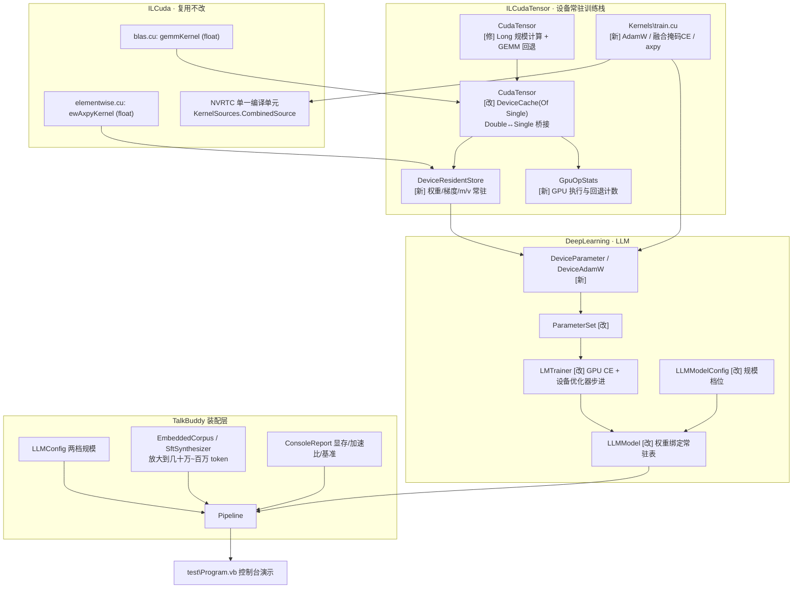

## 产品概述

在 `TalkBuddy` 项目中基于既有 sciBASIC# 计算栈，把实验性 LLM demo 从"小巧可读"升级为"**真正跑在 GPU 上、规模与数据量都显著放大**"的训练与推理演示：修复当前 CUDA 后端的崩溃缺陷，改造 GPU 后端为设备常驻训练栈，将模型放大到约 2 亿参数、训练数据放大到几十万至几百万 token，并在控制台完整展示显存占用、设备算力与 CPU/GPU 加速比。

## 核心功能

### 1. 修复 CUDA 后端崩溃（当前阻塞项）

不带 `--no-cuda` 直接运行时会抛 `OverflowException`。修复后，工具调用 SFT 阶段（`batch=2, seq=128`，LM head 为 `[256,128]×[128,128815]`）不再崩溃，CUDA 路径可完整跑通三阶段训练与全部演示。

### 2. 设备常驻训练栈（本轮主体）

把 GPU 后端从"逐算子主机暂存"改造为**设备常驻**：权重、梯度、优化器状态（m/v）以单精度常驻显存，训练全程不再每步重传整个模型；新增 GPU 侧融合内核承担 AdamW 更新与掩码交叉熵，消除大词表下最重的两处主机侧循环。显存容量可配置，并输出真实占用与余量。

### 3. 精度策略：GPU 内部 FP32 + 主机 Double

主机端保留双精度主副本以保证与 CPU 路径可比、便于检查点落盘；设备端改用单精度以获得消费级显卡上高一个数量级的算力。演示中给出实测的 FP64/FP32 吞吐对比，用数据说明为何必须走 FP32，而非仅凭断言。

### 4. 模型规模放大

提供两档可配置规模：

- `Scale200M`（约 1.9 亿参数，d_model=768、12 层、16 路由专家 + 2 共享专家、词表 12.8 万）——默认档，契合"半小时以内"。
- `Scale400M`（约 4 亿参数）——单精度下才能真正把 8GB 显存用满。

演示同时打印两档的显存估算，并在 200M 档打通后再实测 400M 档耗时。

### 5. 训练数据放大

保持完全离线自包含：内置预训练语料扩充为多主题、多语言的长文本，并把模板合成的"指令→回复"与工具调用轨迹规模提升到几十万至几百万 token 量级。

### 6. 规模与性能的可观测展示

控制台输出设备名称与显存总量/可用量、权重与优化器状态的设备占用、每步耗时、CPU 与 GPU 加速比、各算子的 GPU 执行与 CPU 回退次数，以及两档规模的参数量与激活参数量对比。

### 7. 既有能力不回退

KV Cache 逐 token 一致性与计时、约束解码 Schema 校验、权重重载一致性、MoE 负载均衡统计全部保持通过；`--no-cuda` 的纯 CPU 路径必须仍然完整可跑。

## 呈现效果

控制台程序按序输出：设备与显存概览、设备能力基准、模型结构与两档参数量对比、三阶段训练进度（loss/困惑度/学习率/单步耗时）、显存占用曲线、MoE 路由分布、采样策略对比、KV Cache 验证、多轮 Function Calling Agent Loop、约束解码校验、权重持久化。

## 技术栈

- 语言/框架：VB.NET，`net10.0`，沿用 sciBASIC# 计算栈，不引入任何第三方依赖。
- 张量运行时：`Data_science\MachineLearning\TensorFlow\TensorFlow.vbproj`（`Tensor` + 可插拔 `Compute.ITensorCompute` 后端）。
- GPU 后端：`cuda\ILCudaTensor\ILCudaTensor.vbproj`（`GPUTensor.CudaTensor`，`Inherits TensorComputeBase`）+ `cuda\ILCuda\ILCuda.vbproj`（内核源码注册、NVRTC 编译、驱动 API）。
- 深度学习基座：`DeepLearning.NET6.vbproj`（`Transformer` 命名空间 + 新增 `LLM` 命名空间）。
- 分词：`NLP.NET.vbproj` 的 `ChineseTokenizer.HuggingFace.HuggingFaceTokenizer`，加载 DeepSeek 全量约 12.8 万词表。
- 测试宿主：`TalkBuddy\test\test.vbproj`（Console Exe）。

## 实现方案

### 总体策略

分三步走，每步独立可验证：

1. **先修崩溃**（必做、低风险）：`CudaTensor` 中规模计算一律改用 `Long`，并补齐 GEMM 内核回退。
2. **再改设备存储**：把 `CudaTensor` 的设备缓冲从 `Double` 切到 `Single`，新增设备常驻注册表，使权重、梯度、优化器状态长期驻留显存。
3. **最后补手写融合内核**：新增 `Kernels\train.cu` 承担 AdamW 与掩码交叉熵，消除主机侧最重的循环。

### 关键决策与依据

**决策 1：`m * k * n` 的 `Int32` 溢出是唯一直接原因。**
`CudaTensor.vb:561` 的 `If m * k * n < MinGemmElements` 以 Int32 运算。LM head 为 `[rows,128]×[128,128815]`：

| 阶段 | rows | m*k*n | vs Int32 上限 2,147,483,647 |
| --- | --- | --- | --- |
| 预训练 | 64 | 1,055,091,200 | 未超 |
| 指令 SFT | 96 | 1,582,636,800 | 未超 |
| 工具 SFT | 256 | **4,220,364,800** | **超出 → 崩溃** |


与"只崩在 `RunToolSft`"完全吻合。同一表达式在 `SIMDTensor.MatMul`（第 211-222 行）早已用 `Long` 修过，CUDA 后端漏改。同一文件 `Transpose`（第 639 行 `rows * cols`）与 `ElementCount`（第 659-667 行累乘）属同类隐患，一并改净。

**决策 2：`DeviceBuffer` 的 `Int32` 计数契约是硬边界，必须显式处置。**
`ILCuda\Runtime\DeviceBuffer.vb`：`Public Sub New(count As Integer)`、`ReadOnly Property Count As Integer`。单算子输出元素数上限 21.5 亿，超出时应给出可读诊断或回退 CPU，而不是让 Int32 静默溢出。

**决策 3：`MatMul` 缺内核回退，只改溢出会把崩溃点后移。**
`MatMul` 直接 `_engine.GetKernel(TensorKernelNames.GemmDouble)`，而同文件 `Transpose`（第 629 行）先查 `DoubleKernelRegistry.Available`，`Conv2D` 用 `TryKernel`（第 673-679 行，内部 try/catch）。因溢出发生在 `GetKernel` 之前，**该 GEMM 内核是否可用从未被验证过**。必须改用 `TryKernel`，取不到即回退 CPU，与既有"算子永不失效"设计一致。

**决策 4：FP32 设备存储是这个栈的原始设计意图，而非新发明。**
`DeviceCache.vb` 第 81-83 行逐字注释：「泛型参数 T 表示显存缓冲的元素类型（**Single** / Double）：* Single 用于框架自带的 float 内核（GEMM / 归约）」。且 `GetBuffer(engine, host As Double(), version, convert As Func(Of Double(), T()))` 的**主机侧永远是 `Double()`**，`convert` 负责降精度。`DoubleKernels.vb` 第 74-75 行也印证「ILCuda 自带内核（全部是 float）…因此 Tensor 的逐元素运算不再需要 Double -> Single 的降精度桥接」。
→ 切换只需把 `CudaTensor` 的 `DeviceCache(Of Double)` 换成 `DeviceCache(Of Single)`，并把 `Device(t)` 的恒等转换改为 `Double → Single`、读取处 `Single → Double`。当前实现是 `Function(d) d` 恒等转换（真 FP64）。

**决策 5：FP32 是消费级 8GB 卡唯一可行的路。**
8GB 显存意味着消费级卡，其 FP64 被砍到 FP32 的 1/64（RTX 3070 约 0.31 TFLOPS），而现代 CPU 的 AVX2 双精度约 0.4-0.9 TFLOPS——**FP64 下 GPU 反而更慢**。FP32 约 13-20 TFLOPS，才能带来一个数量级的提升。复用 `ILCuda\Kernels\blas.cu` 的 FP32 `gemmKernel`（`KernelNames.Gemm = "gemmKernel"`，`C(m×n)=A(m×k)*B(k×n)`，16×16 分块 + 共享内存，**索引全程 `size_t` 转换故内核内部无溢出风险**，启动形状 `For2D(m, n, 16, 16)`）。

**决策 6：融合训练内核必须手写 `.cu`，IL2Cuda 无法表达。**
已逐项核实 `IL2Cuda` 能力：支持数值 `For`（含 Step）、`While`、`If/Else`、三元、局部变量、数组索引读取、返回值、`System.Math` 数学函数，且**多数组 + 多标量形参能正确映射**。但**不支持**：

- **多输出 / inout 数组**——数组形参被强制 `const T* __restrict__`（`IlCudaKernel.vb` L321、L353-355），只有一个 `il_out` 且每线程只写一个元素（L361-367、L405），`<CudaOutputAttribute>` 无实际效果。→ **AdamW 单内核同时更新 param/m/v 并清零 grad 不可表达**。
- `Continue For` / `Exit For`（`CudaEmitter.vb` L166 抛异常）、`For Each` 与 `.Length`（L276-277 抛异常）、`Select Case`（>2 路）、`Try`/`SyncLock`/lambda/字符串。
- **共享内存 / `__syncthreads`**——`gemm.cu` L9-10 注释明确因此不走 IL2Cuda。

→ 带 block 归约的融合交叉熵与多输出的 AdamW 必须手写 `.cu`。机制上完全可行：`KernelSources.Register(asm)` 扫描程序集 manifest 中**凡以 `.cu` 结尾**的资源（`KernelSources.vb` L113-114），`CombinedSource()`（L205-218）把内置与 IL2Cuda 生成源码拼成**单一 NVRTC 编译单元**。只需新增文件 + 在 `.vbproj` 加 `<EmbeddedResource Include="Kernels\train.cu" />`。

**决策 7：设备常驻是消除"每步重传整个模型"的唯一办法。**
`Tensor.Version` 机制健全（`MarkHostModified` 会自增，`AdamW.vb:114` 也确实调用了），因此不会读到陈旧显存副本。但这也正是问题所在：**权重每步都变 → 版本不匹配 → `Device()` 重新上传整个模型**。200M 参数在 FP32 下即 764 MB/步，纯属浪费。因此需新增"钉住（pin）"机制：把权重的主副本放在设备上，`Device()` 优先查 pin 表并跳过版本校验。

**决策 8：规模与显存存在张力，必须显式处置。**
用户选"约 2 亿参数"时，选项描述基于**双精度**（2 亿 × 8 字节 × 4 份状态 = 6.4 GB）；但随后选择 FP32 后前提变了：**2 亿 × 4 字节 × 4 = 3.2 GB，只用掉 8GB 的 40%**。方案不擅自推翻已确认选择，而是**做成可配置档位**并同时打印两档显存估算：`Scale200M` 为默认（契合半小时预算），`Scale400M` 用于真正吃满 8GB。

参数量估算（词表 128,815，嵌入与 LM head 权重绑定）：

- 嵌入 = 128,815 × d_model
- 注意力 = 4 × d_model² × 层数
- MoE/层 = (路由专家 + 共享专家) × 3 × d_model × expert_hidden

`d_model=768, 12 层, 16+2 专家, expert_hidden=128` → 98.9M + 28.3M + 63.7M ≈ **190.9M**。
`d_model=1024, 12 层, 16+2, expert_hidden=256` → 131.9M + 50.3M + 169.9M ≈ **352M**。

**决策 9：不改既有 LLM 前向/反向的数学结构。**
已通过证据链确认 `BatchedMatMul` 的二维快路径 `a2.MatMul(b)` → `Tensor.MatMul` → `computeKernel.MatMul`（`Tensor.vb:909`），因此**注意力 Q/K/V/O（`CausalSelfAttention.vb` L230-232/358/505-507）、MoE 专家 FFN（`SwiGLUFeedForward.vb` L115-116/132/155/195-196）、路由器（`MoELayer.vb` L341/741）的 GEMM 已经在走 CUDA**。这意味着**只要让 `CudaTensor` 支持 FP32 常驻并钉住权重，这些 GEMM 会自动直读显存权重，无需改动任何 LLM 模块**。这是改动面最小的切入点。

### 性能与可靠性

- **单步复杂度**：`O(B·S·d²·L + B·S·d·V + B·S·d·H·E_act)`。200M 参数下绝对大头是 LM head 的 `d·V`（`V≈1.29e5`）与 MoE 专家 FFN。
- **主要收益来源**：

1. 权重常驻 → 消除每步 764 MB 的整模重传；
2. GPU AdamW 融合内核 → 消除 1.91 亿元素 × 4 数组的主机循环；
3. GPU 融合掩码交叉熵 → 消除 `[rows, 128815]` 量级的主机循环。

- **仍需主机侧的**（须在报告中如实说明并实测占比）：注意力打分/softmax/PV 手写循环、`LLMTensorOps` 的逐元素算子、`MoE` 的 gather/scatter、`RmsNorm` 的宿主循环（注意其会读 `Gamma.Data`，γ 是权重）。
- **时间预算**：200M 档目标单步 0.2-0.5 s、总步数数百步，整次演示控制在半小时内。器件能力以实测为准。
- **数值稳定性**：RMSNorm eps、softmax 减最大值、交叉熵 `max(p,1e-12)`、全局梯度范数裁剪、warmup + cosine、`TensorOps.Seed` 固定种子。FP32 设备端与原 FP64 路径会有微小数值差异，须在报告中说明而非隐去。
- **显存可靠性**：常驻分配走独立的 `DeviceBuffer(Of Single)` 所有权，**不经过 `DeviceCache` 的 LRU 淘汰**（LRU 超限只淘汰不抛异常，但会破坏常驻语义）；常驻表须在 `CudaTensor.Unregister`/`Dispose` 时显式释放。分配前用 `cuMemGetInfo_v2` 查可用显存并给出可读的显存不足诊断。

### 跨工作区改动与向后兼容

- 基础库位于工作区外的 `E:\codebuddy\GCModeller\src\runtime\sciBASIC#\`，用户已在原始需求及本轮明确授权。
- **必须保持向后兼容**：`CudaTensor` 切 FP32 会改变 `ILCudaTensor\test` 的数值预期，需在报告中说明；`--no-cuda` 纯 CPU 路径（`SIMDTensor`）**不得受任何影响**；`Register(options)` 新增的显存容量参数须带默认值，不破坏既有调用方。
- **早先"不触碰 `.cu`"的承诺在用户选择"真·设备常驻训练栈"后不再成立**，新增手写 `.cu` 是必需的。

## 架构设计



### 数据流

- **训练步**：batch `[B,S]` → 词嵌入查表（主机）→ 逐层 `RMSNorm`（主机）+ `MatMul`（GPU 直读常驻权重）+ MoE（GPU GEMM + 主机 gather/scatter）→ 末端 RMSNorm → LM head GEMM（GPU 直读常驻权重）→ 融合掩码交叉熵（GPU 内核，输出梯度）→ 反向（GPU GEMM 累积梯度至常驻梯度缓冲）→ GPU AdamW 融合内核原地更新 param/m/v 并清零梯度。
- **显存统计**：常驻表汇总各条目字节数 + `cuMemGetInfo_v2` 报出总量/可用/峰值。
- **CPU 回退**：`--no-cuda` 时全部走 `SIMDTensor` + `AdamW` 主机实现，路径与改造前完全一致。

## 目录结构

```
cuda/ILCudaTensor/
├── ILCudaTensor.vbproj              # [MODIFY] 新增 <EmbeddedResource Include="Kernels\train.cu" />
├── GPUTensor/
│   ├── CudaTensor.vb                # [MODIFY] 主修复+改造文件
│   ├── DeviceResidentStore.vb       # [NEW] 设备常驻缓冲注册表
│   ├── GpuOpStats.vb                # [NEW] GPU 执行/回退计数器
│   └── TensorKernels.vb             # [MODIFY] 新增 train.cu 内核名常量
└── Kernels/
    └── train.cu                     # [NEW] 手写融合训练内核

Data_science/MachineLearning/DeepLearning/
└── LLM/
    ├── DeviceParameter.vb           # [NEW] 设备常驻权重
    ├── DeviceAdamW.vb               # [NEW] GPU 侧 AdamW 驱动
    ├── ParameterSet.vb              # [MODIFY] 支持设备常驻登记
    ├── LMTrainer.vb                 # [MODIFY] GPU 融合交叉熵 + 设备优化器步进
    ├── LLMModel.vb                  # [MODIFY] 权重绑定常驻表 + 显存统计
    └── LLMModelConfig.vb            # [MODIFY] 规模档位与参数量估算

TalkBuddy/
├── LLMConfig.vb                     # [MODIFY] Scale200M / Scale400M 两档 + 数据量档
├── Corpus/
│   ├── EmbeddedCorpus.vb            # [MODIFY] 扩充多主题多语言长语料
│   ├── SftSynthesizer.vb            # [MODIFY] 放大指令样本规模
│   └── ToolCallSynthesizer.vb       # [MODIFY] 放大工具调用轨迹规模
├── ConsoleReport.vb                 # [MODIFY] 显存占用/设备基准/加速比报告段
├── Pipeline.vb                      # [MODIFY] 装配两档规模与设备训练
└── test/Program.vb                  # [MODIFY] 呈现验收数据
```

### 关键文件的实现要求

- **`CudaTensor.vb`**：`MatMul` 用 `CLng(m) * k * n` 判定阈值、`m*n` 与 `Transpose` 的 `rows*cols`、`ElementCount` 累乘全部走 `Long` 并做 Int32 越界诊断；`MatMul` 改用 `TryKernel` 回退；`DeviceCache(Of Double)` → `DeviceCache(Of Single)`，设备缓冲全部 FP32，`MatMul` 改派发 `KernelNames.Gemm`（FP32），读取处 `Single → Double`；`Device(t)` 先查常驻表再查 LRU；`Register(options, Optional cacheBytes)` 增加显存容量参数（带默认值）。
- **`DeviceResidentStore.vb`**：以主机数组引用为键登记常驻 `DeviceBuffer(Of Single)`；提供 `Pin`/`Unpin`/`IsPinned`/`Pointer`/`TotalBytes`/`FreeBytes`/`Dispose`；分配前用 `cuMemGetInfo_v2` 预检并给出可读的显存不足诊断。
- **`Kernels\train.cu`**：`tensorAdamWFp32Kernel(float* p, float* g, float* m, float* v, int n, float lr, float b1, float b2, float eps, float bc1, float bc2, float wd)` 单线程一格、原地更新并清零梯度；`tensorMaskedCrossEntropyFp32Kernel` 融合 softmax + 交叉熵 + `d(logits)=softmax−onehot`，用 block 归约求每行 max/sum，按 lossMask 跳过；`tensorAxpyFp32Kernel` 用于梯度累加到常驻缓冲。全部用 `size_t` 索引，避免 Int32 溢出。
- **`DeviceParameter.vb` / `DeviceAdamW.vb`**：主机 `Double` 主副本 + 设备 FP32 常驻缓冲（权重/梯度/m/v）；提供 `Upload`/`Download`/`ZeroGrad`/`Step`；`Step` 调用 `tensorAdamWFp32Kernel`；导出设备字节占用供统计。
- **`LLMConfig.vb`**：新增 `Scale200M` 与 `Scale400M` 两档预设并给出参数量与显存估算；`EmbeddedCorpus` 扩充为多主题多语言长文本，`SftSynthesizer`/`ToolCallSynthesizer` 提升合成规模到几十万至几百万 token。
- **`ConsoleReport.vb` / `test\Program.vb`**：新增"设备与显存概览""设备能力基准（FP64/FP32 GEMM vs CPU）""两档规模参数量与显存对比""GPU 执行/回退统计"四个输出段。

## Agent Extensions

### SubAgent

- **code-explorer**
- Purpose: 在跨工作区的大仓库中定位本方案剩余的实施接入点——`ILCudaTensor.vbproj` 的 `EmbeddedResource` 资源清单位置、`ILCuda` 中 FP32 内核（`gemmKernel`/`ewAxpyKernel`）的既有启动封装与 `WriteArgument` 参数约定、`ParameterSet.Attach` 与 `AdamW.MakeTrainingStep` 的全部调用点、`LMTrainer`/`LLMModel`/`Pipeline`/`ConsoleReport` 的可插入位置，以及 `ILCudaTensor\test` 中会因 FP32 切换而受影响的自比较用例。
- Expected outcome: 产出精确的文件路径 + 行号 + 符号清单，确保同类 Int32 隐患一次改净、FP32 切换不误伤既有调用方、演示层新增输出段有明确落点。

### Skill

- **lsp-code-analysis**
- Purpose: 以语义方式核对改造后的引用完整性——确认 `ITensorCompute` 的全部实现类（`SIMDTensor`、`TensorComputeBase`、`CudaTensor`）在新增加载/存储路径下行为一致；确认 `CudaTensor` 从 `Double` 切到 `Single` 后所有覆写方法的签名与调用契约未被破坏；确认新增 `DeviceParameter`/`DeviceAdamW`/`DeviceResidentStore` 成员的访问可见性正确且无编译破坏。
- Expected outcome: 得到完整实现清单与调用点列表，保证跨后端行为一致、无编译破坏；未通过项如实列出并定位到具体行。