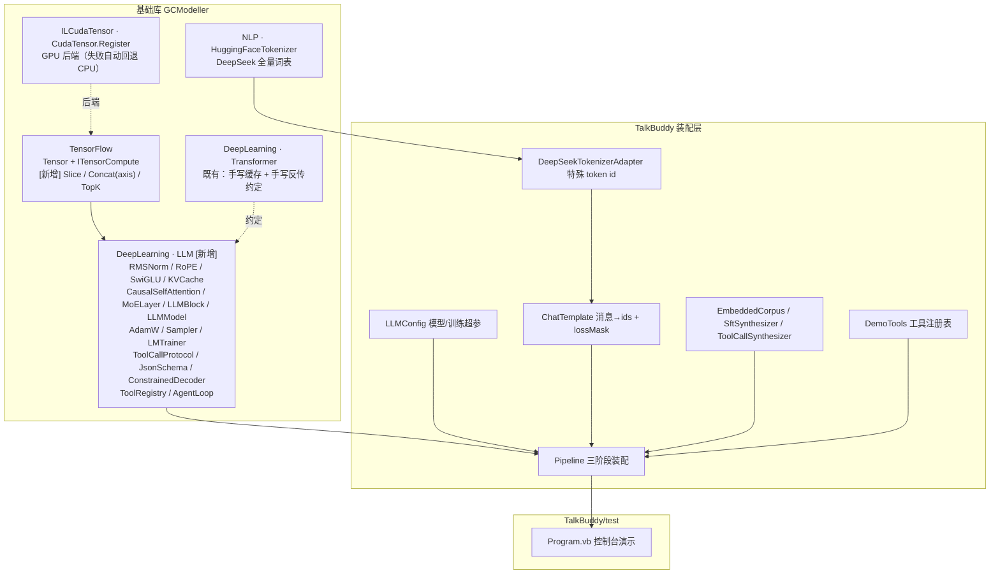

## User Requirements

在 `TalkBuddy\TalkBuddy.vbproj` 项目中，参考 `TalkBuddy\readme.md` 的理论描述，实现一个**实验性质、面向算法原理学习**的 LLM 算法 DEMO。要求包含三大核心机制的完整实现：**MoE 架构**、**KV Cache**、**Function Calling**。

必须复用现有基础算法栈：`TensorFlow.vbproj`（张量算子）、`DeepLearning.NET6.vbproj`（Transformer 模型）、`NLP.NET.vbproj`（分词）、`ILCuda/ILCudaTensor.vbproj`（CUDA 基础设施与 GPU 张量加速），并直接加载 `nlp\hugging_face_tokenizer` 得到 token。基础库缺失的算法内容直接补充进基础库。

最终在 `TalkBuddy\test\test.vbproj` 中编写测试代码，完整展示"**从模型训练到模型测试**"的全过程。模型参数量不需要大，重点是可读、可学习的算法实现。

## Product Overview

一个纯托管的 decoder-only 小规模 LLM 算法 Demo：从 DeepSeek 真实分词器的全量约 10 万词表出发，经过"预训练 → 指令跟随 SFT → Function Calling SFT"三阶段训练，最终以控制台形式完整展示模型构建结果、生成效果与三大机制的工作原理。

## Core Features

1. **MoE 架构（DeepSeekMoE）**：细粒度专家分割（多个小专家）+ 共享专家隔离（每个 token 无条件激活）+ Sigmoid 归一化 Top-K 路由 + 无辅助损失的动态偏置负载均衡 + 节点受限路由。可输出每层专家负载分布与路由统计。
2. **KV Cache**：已生成 token 的 K/V 缓存复用，增量解码单步开销从 O(t²) 降到 O(t)；可对比"有缓存 / 无缓存"的输出一致性与单步耗时。
3. **Function Calling**：工具 JSON Schema 注入 → 生成特殊 token 工具调用序列 → 约束解码保证 JSON 语法合法 → 解析参数 → 执行真实函数 → 结果回填并**复用 KV Cache 前缀** → 多轮 Agent Loop。
4. **训练流水线**：三阶段训练（预训练下一个 token 预测 → 指令 SFT → 工具调用 SFT），SFT 阶段对 user 与 tool 结果 token 做 loss mask；含 AdamW、学习率调度、梯度裁剪。
5. **推理与采样**：贪心 / 温度 / Top-k / Top-p / 重复惩罚采样策略，支持逐 token 自回归生成。
6. **构建结果展示**：模型结构与参数量统计（总参数量 vs 每 token 激活参数量与激活率）、训练 loss/困惑度曲线、生成样例、专家负载直方图。

## Clarified Decisions

- 词表：**完全使用 DeepSeek 全量约 10 万词表**（已接受输出投影层大、训练慢的代价）。
- 语料：**代码内置小语料 + 模板程序化合成**，完全离线自包含。
- 阶段：**完整三阶段**。
- 落点：**MoE / KVCache 等 LLM 算法模块全部下沉到 DeepLearning 基础库**，TalkBuddy 只做装配与测试。

## Tech Stack

- 语言/框架：VB.NET，`net10.0`，沿用 sciBASIC# 计算栈（不引入任何新范式或第三方依赖）。
- 张量运行时：`Data_science\MachineLearning\TensorFlow\TensorFlow.vbproj`（`Tensor` + 可插拔 `Compute.ITensorCompute` 后端，默认 `SIMDTensor` SIMD CPU）。
- GPU 加速：`cuda\ILCudaTensor\ILCudaTensor.vbproj` 的 `Microsoft.VisualBasic.Computing.ILCuda.GPUTensor.CudaTensor.Register()`；注册失败自动回退 CPU。
- 深度学习基座：`Data_science\MachineLearning\DeepLearning\DeepLearning.NET6.vbproj`（`Transformer` 命名空间）。
- 分词：`nlp\NLP\NLP.NET.vbproj` 的 `ChineseTokenizer.HuggingFace.HuggingFaceTokenizer`，加载 `nlp\hugging_face_tokenizer`（`tokenizer.json` 8.1 MB，DeepSeek 全量词表；`tokenizer_config.json` 已带完整工具调用 chat_template）。
- 优化器：扩展 `Transformer.Optimizer`（现为 Adam）为可选解耦 weight decay 的 AdamW。
- 测试宿主：`TalkBuddy\test\test.vbproj`（Console Exe，已引用 `TalkBuddy.vbproj` 与全部基础库）。

## Implementation Approach

### 总体策略

在基础库中新建 `DeepLearning\LLM\` 模块（命名空间 `Microsoft.VisualBasic.MachineLearning.LLM`），以**与既有 `Transformer` 命名空间完全一致的"前向缓存 + 手写反向传播"约定**实现 LLM 全栈；TalkBuddy 仅做配置、分词器适配、chat template、语料合成、工具注册与装配；`test` 项目完成三阶段训练与全部演示。

### 关键决策与权衡

1. **不引入自动微分**：既有 `TransformerModel.vb` 注释明确"迁移到纯数值 Tensor 之后改为显式 BPTT"。延续该约定可避免新增架构范式，且显式反传恰好服务于"算法原理学习"的目标；代价是代码量较大。
2. **全量词表 + 权重绑定（tie embeddings）+ 可配置 `VocabLimit`**：满足"全量词表"要求的同时，让 `[vocab, d_model]` 只驻留一份；`VocabLimit`（默认 `0` = 全量）仅用于快速冒烟与回归，不改变语义。
3. **RoPE 取代正弦绝对编码**：readme 指出 Llama/Qwen/Mistral/DeepSeek 均采用 RoPE，且 RoPE 与 KV Cache 增量解码天然契合（只需按绝对位置旋转）。同时保留"位置信息注入方式"可插拔。
4. **Pre-Norm + RMSNorm + SwiGLU**：对齐 readme 所述现代 LLM 做法。
5. **MoE 严格对齐 readme 公式**：`h_t = Σ_{i≤K_s} FFN_i(u_t) + Σ_{i>K_s} g_{i,t}·FFN_i(u_t) + u_t`；Sigmoid + Top-K 门控；负载均衡使用偏置项 `p_k += ε·(L − A_k)`（`ε = u/|L − A_k|`），**不对主损失加辅助损失项**；实现节点受限路由（专家分组为节点，Top-K 限制在 M 个节点内）。反向只回传 Top-K 命中专家，与稀疏前向对称。
6. **KV Cache 只服务推理，训练全序列并行前向**：这样"有/无缓存输出一致 + 单步耗时对比"可以直接作为可验证的正确性证据。
7. **约束解码用"JSON Schema 状态机 + token 前缀 trie"**：10 万词表下每步全量枚举代价过高；按状态机计算合法 token 集合，配合 trie 增量裁剪与首字符分桶，是 readme 所述 FSM 做法的可行工程落地。
8. **不改 `.cu` 内核**：`CudaTensor` 继承 `TensorComputeBase`，未重写的算子自动继承 CPU 实现（README 明确"算子永不失效"）。新增算子只需在契约层 + SIMD 层 + 标量兜底层三处实现，GPU 路径自动安全回退，显著收敛改动面。

### 性能与可靠性

- 训练单步复杂度：`O(B·S·d²·L + B·S·d·V + B·S·d·H·E_act)`，瓶颈是 LM head 的 `d·V`（`V≈1e5`）。
- 缓解手段：weight tying、`VocabLimit` 冒烟档、CUDA 后端优先、`batch/seq` 可配、padding/非 target 位置跳过 loss 计算、仅对 Top-K 专家做稀疏反向。
- 推理单步：有 KV Cache 为 `O(t·d² + d·V)`（注意力段 `O(t·d)`），无缓存为 `O(t²·d)`；测试输出实测加速比。
- 内存：AdamW 需 `param + m + v` 三份 `Double`，配置层显式提示内存量级；KV Cache 内存随序列线性增长并做统计输出。
- 数值稳定：RMSNorm eps、softmax 减最大值、交叉熵 `max(p, 1e-12)`、全局梯度范数裁剪、warmup + cosine 学习率、`TensorOps.Seed` 固定随机种子保证可复现。
- 明确预期：小模型 + 小语料下生成质量有限，验收口径是**算法链路正确、指标趋势合理、机制可验证**，而非通用对话质量。

### 跨工作区改动说明

基础库位于工作区之外的 `E:\codebuddy\GCModeller\src\runtime\sciBASIC#\`。本次改动仅做**向后兼容的增量补充**（新增虚方法/新文件/带默认参数的可选扩展），不修改既有算子语义与既有 Transformer 行为，避免影响翻译 demo 等现有调用方。

## Architecture Design



### 数据流

- **预训练**：内置语料 → `EncodeToIds` → `[B,S]` → `LLMModel.Forward` → `logits[B,S,V]` → 交叉熵 → 手写反传 → AdamW。
- **指令/工具 SFT**：`ChatTemplate.Render(messages)` → `ids + lossMask` → 带掩码交叉熵（user 与 tool 结果 token 不计 loss）→ 反传。
- **Function Calling 推理**：工具 Schema 序列化进 prompt → prefill（写入 KV Cache）→ 逐 token 采样（约束解码掩码 logits）→ 检测工具调用特殊 token → 解析 `name + arguments` → 执行 CLR 函数 → 结果以 `tool` 角色回填并**复用 KV Cache 前缀**（只 prefill 新增 token）→ 继续生成，直至无工具 token 或达最大轮次。

## Implementation Notes

- **严格延续既有约定**：新模块每个组件都要暴露 `LastCache`/`Cache` 类型，反向显式接收当步缓存快照；梯度用同形张量 + 原地 `+=` 累加；`MakeTrainingStep(lr, step, param)` 完成更新并清零梯度。
- **复核非污染**：`Transformer\TensorOps.vb`、`Transformer\OutputLayer.vb` 等既有文件被翻译 demo 复用，新增算子放入新的 `LLM\LLMTensorOps.vb`，避免改变既有行为。修改 `Optimizer` 时用带默认值的可选参数保持向后兼容。
- **算子三处对齐**：新增张量算子必须同时在 `ITensorCompute` 契约、`SIMDTensor` 实现、`TensorComputeBase` 标量兜底三处落地，否则 CUDA 后端切换时可能出现行为不一致。
- **可观测性**：复用现有控制台输出风格（`Console.WriteLine`），结构化打印 loss/困惑度/学习率/梯度范数/单步耗时、MoE 专家负载直方图、KV Cache 字节数、约束解码的合法 token 集合大小；避免在训练内循环高频打印。
- **数值与随机性**：全局固定 `TensorOps.Seed`；反传前做全局梯度范数裁剪；学习率采用 warmup + cosine，避免小模型训练发散。
- **改动边界**：不重构既有 Transformer/CNN/RNN，不调整 `TalkBuddy.vbproj` 已有的引用列表；新增文件由 SDK 默认通配自动纳入编译。

## Directory Structure

### 基础库（跨工作区：`E:\codebuddy\GCModeller\src\runtime\sciBASIC#\`）

```
Data_science\MachineLearning\
├── TensorFlow\
│   ├── Compute\ITensorCompute.vb     # [MODIFY] 契约新增 Slice(t,axis,start,len)、Concat(a,b,axis)、TopK(t,k,axis)。三者在既有 SIMD 后端与 CUDA 后端均缺失，是 KV Cache 沿序列维拼接与 MoE/Sampling 取 Top-K 的前置条件。新增方法须带 XML 文档并说明反向无需梯度。
│   ├── Compute\SIMDTensor.vb         # [MODIFY] 三个新算子的 SIMD CPU 实现。Slice/Concat 按块 Array.Copy 实现（沿任意轴先算 stride 再搬移）；TopK 按最后一维做部分选择（k 远小于 n 时用大小为 k 的插入式堆/选择，避免全排序）。
│   ├── Compute\TensorComputeBase.vb  # [MODIFY] 标量兜底实现，保证未重写该算子的后端（如 CUDA）自动回退 CPU 且不抛异常。
│   └── NumPy.vb                      # [MODIFY] 增加 slice / take_along_axis / topk 的 NumPy 风格薄包装，保持 API 一致性（可选但推荐）。
└── DeepLearning\
    ├── Transformer\Optimizer.vb      # [MODIFY] 增加可选 weightDecay 参数实现 AdamW 解耦权重衰减；默认 0 时行为与现有 Adam 完全一致（向后兼容），不改变既有 Transformer 训练结果。
    └── LLM\                          # [NEW] 目录，命名空间 Microsoft.VisualBasic.MachineLearning.LLM
        ├── LLMTensorOps.vb           # [NEW] LLM 专属算子与手写反向：RmsNormForward/Backward、RopeApply/RopeBackward、SwiGLU 激活与其反向、因果掩码（含 KV Cache 起始偏移的变体）、掩码交叉熵及 d(logits)=softmax−onehot、GatherRows/ScatterAddRows（按行查表与散射累加）、全局梯度范数裁剪。
        ├── RmsNorm.vb                # [NEW] RMSNorm 模块：可学习 γ，Forward(x)/Backward(cache,dOut)，缓存 invRms 供反传；Pre-Norm 用法。
        ├── RotaryEmbedding.vb        # [NEW] RoPE：按维度对预计算 cos/sin 表（支持外推基数 theta），Apply(x, positions)/Backward(dOut, positions) 用旋转的逆；支持 Prefill 批量与增量单位置。
        ├── KVCache.vb                # [NEW] 每层 K/V 缓存：按 (maxSeq, nHeads, headDim) 预分配，Append(k,v,pos) 原地写入、Length 计数、Reset()、MemoryBytes 统计、可选的容量增长策略；为 GQA/MQA 预留 nKvHeads 参数。
        ├── CausalSelfAttention.vb    # [NEW] Pre-Norm 因果自注意力：Wq/Wk/Wv/Wo；Forward(x, positions) 全序列训练路径（因果掩码）与 Prefill(ids) / DecodeStep(x, pos, cache) 增量路径（KV Cache 读写）；Backward 分别处理两条路径。
        ├── FeedForward.vb            # [NEW] SwiGLU 稠密前馈（gate/up/down 三权重），同时作为 MoE 专家的内部实现。
        ├── Expert.vb                 # [NEW] 单个专家包装（内含 SwiGLU），暴露 Forward/Backward/MakeTrainingStep/ZeroGradients。
        ├── MoELayer.vb               # [NEW] DeepSeekMoE 核心：nRoutedExperts / topK / nSharedExperts / nodeGroups；Router = Sigmoid→加偏置→Top-K→权重归一化；共享专家无条件前向；无辅助损失 bias 更新（读取 LastRouteInfo 的负载直方图）；节点受限路由；反向按 g 加权回传并穿过 sigmoid 导数；LastRouteInfo 暴露每层专家负载与激活参数量。
        ├── LLMBlock.vb               # [NEW] Pre-Norm 解码层：x += Attn(RMSNorm(x))；x += MoE_or_FFN(RMSNorm(x))；支持按层索引选择稠密 FFN 或 MoE（首层稠密、其余 MoE，对齐 DeepSeek 做法）。
        ├── LLMModel.vb               # [NEW] decoder-only 模型：token embedding [vocab,d_model] 与 LM head 权重共享（weight tying）；N 层 LLMBlock 堆叠；末端 RMSNorm；Forward(ids)→logits 训练路径；Prefill(ids)/DecodeStep(id,pos) 增量推理路径；Caches 管理；Save/Load 权重；Parameters/ActiveParameters/VocabSize 统计。
        ├── Sampler.vb                # [NEW] 采样策略：Greedy、Temperature、Top-k、Top-p（核采样）、RepetitionPenalty；SamplingConfig 配置对象；对 logits 做原地掩码/缩放后按概率采样。
        ├── LMTrainer.vb              # [NEW] 训练器：batch 切分与 padding、带 lossMask 的交叉熵、跨 batch 梯度累积、全局梯度范数裁剪、warmup+cosine 学习率、训练步统计（loss/perplexity/lr/耗时）；供三阶段复用。
        ├── ToolCallProtocol.vb       # [NEW] DeepSeek 工具调用 token 协议常量与编解码：<｜tool▁calls▁begin｜>/<｜tool▁call▁begin｜>/<｜tool▁sep｜>/<｜tool▁call▁end｜>/<｜tool▁calls▁end｜> 与 <｜tool▁outputs▁begin｜>/<｜tool▁output▁begin｜>/<｜tool▁output▁end｜>/<｜tool▁outputs▁end｜>；FormatCall/FormatResult/ParseCalls（基于前缀扫描的增量解析，支持流式碎片拼接）。
        ├── JsonSchema.vb             # [NEW] JSON Schema 轻量模型：Type/Properties/Required/Enum/Default；可输出为注入 prompt 的说明书文本；提供按状态机推进的合法字符/取值集合查询。参考 Ollama\JSON\FunctionCall\FunctionModel.vb 的字段设计。
        ├── ConstrainedDecoder.vb     # [NEW] 约束解码：把 JsonSchema 编译为有限状态机；每步按当前状态计算合法 token 集合（token 前缀 trie + 首字符分桶 + 懒加载），对 logits 非法位置置 -inf 再采样；暴露 MatchedTokenCount 等统计以佐证"物理上无法生成非法值"。
        ├── ToolRegistry.vb           # [NEW] 工具注册表：注册 Func(Of 参数表, String) 与对应 JsonSchema；调用前做工具名/参数存在性校验，返回结构化错误串供模型自我修正。
        ├── AgentLoop.vb              # [NEW] 决策→约束解码→执行→回填的循环：最大工具轮次限制、防循环调用检测、工具结果回填后复用 KV Cache 前缀（只 prefill 新增 token）、可选并行工具调用；输出每一步的 Thought/Action/Observation 轨迹。
        └── README.md                 # [NEW] 模块说明：整体架构、三大机制原理与实现要点、与 readme.md 理论的对应关系。
```

### TalkBuddy 装配层（`e:\codebuddy\LLMs\src\TalkBuddy\`）

```
TalkBuddy\
├── TalkBuddy.vbproj            # [MODIFY] 仅在需要时补充/校验引用；新增 .vb 由 SDK 默认通配自动编译，预计无需改动。
├── LLMConfig.vb                # [NEW] 模型超参（vocabSize、dModel、nLayers、nHeads、headDim、maxSeqLen、ropeTheta、tieEmbedding、nRoutedExperts、topK、nSharedExperts、expertHidden、nodeGroups、VocabLimit）与训练超参（lr、wd、warmup、batch、seqLen、gradClip、epochs/steps）；提供 TinyDemoConfig 预设与快速冒烟档。
├── DeepSeekTokenizerAdapter.vb # [NEW] 包装 HuggingFaceTokenizer.FromPretrained 加载 DeepSeek 全量词表；暴露 VocabSize、EncodeIds/Decode、Tokenize；并解析并缓存全部特殊 token 的 id（BOS/EOS/PAD/<｜User｜>/<｜Assistant｜>/工具调用与输出 token），TokenToId 返回空时给出明确错误信息。
├── ChatTemplate.vb             # [NEW] 对齐 tokenizer_config.json 中 chat_template 语义的 VB 渲染器：messages(system/user/assistant/tool，含 tool_calls) → ids + lossMask；实现 add_generation_prompt 追加 <｜Assistant｜>、tool 结果包裹、</think> 截断等规则。
├── Corpus\
│   ├── EmbeddedCorpus.vb       # [NEW] 内置小型中英文预训练语料（多段主题文本，保证离线可跑）；提供滑动窗口采样成 [B,S] 训练样本。
│   ├── SftSynthesizer.vb       # [NEW] 模板程序化合成"指令→回复"样本（多类意图 × 多模板 × 参数槽位随机填充），产出带 lossMask 的 chat 样本。
│   └── ToolCallSynthesizer.vb  # [NEW] 模板合成工具调用轨迹：单步与多步调用、并行调用、参数枚举约束、幻觉工具名负样本与纠错样本，产出含 tool_calls 与 tool 结果的多轮样本。
├── DemoTools.vb                # [NEW] demo 工具实现与 Schema 注册：get_weather(city, units: enum celsius/fahrenheit)、get_current_time(timezone)、calculate(expression)、search_knowledge(query)；返回确定性字符串便于演示。
├── Pipeline.vb                 # [NEW] 装配入口：注册 CUDA 后端（失败打印回退提示）、构建 tokenizer/model/trainer、暴露 Pretrain/Sft/ToolSft/RunInference/RunAgent 各阶段方法、模型结构与参数量统计输出、权重保存与加载。
└── test\
    ├── test.vbproj             # [MODIFY] 已引用 TalkBuddy.vbproj，预计无需改动。
    └── Program.vb              # [MODIFY] 完整 demo 主程序（见下）。
```

### Key Code Structures

仅列出跨模块依赖最紧密的两个新契约（其余以文本描述）：

```
Namespace LLM

    ' 每层 K/V 缓存：增量解码的唯一状态载体
    Public Class KVCache
        Public Sub New(maxSeq As Integer, nKvHeads As Integer, headDim As Integer)
        Public ReadOnly Property Length As Integer          ' 已缓存 token 数（即当前绝对位置）
        Public Sub Append(k As Tensor, v As Tensor)          ' 追加新 token 的 K/V（原地写入）
        Public ReadOnly Property Keys As Tensor              ' [1, nKvHeads, Length, headDim]
        Public ReadOnly Property Values As Tensor
        Public Sub Reset()
        Public ReadOnly Property MemoryBytes As Long         ' 供显存/内存占用统计
    End Class

    ' DeepSeekMoE 层：细粒度专家 + 共享专家 + 无辅助损失负载均衡
    Public Class MoELayer
        Public Sub New(dModel As Integer, expertHidden As Integer,
                       nRoutedExperts As Integer, topK As Integer, nSharedExperts As Integer,
                       Optional nodeGroups As Integer = 1)
        Public Function Forward(x As Tensor) As Tensor       ' x: [B, S, dModel]
        Public Function Backward(cache As Cache, dOut As Tensor) As Tensor
        Public Sub UpdateBalanceBias()                        ' p_k += eps * (L - A_k)
        Public ReadOnly Property LastRouteInfo As RouteInfo   ' 专家负载直方图 / 激活参数量 / 命中节点数
    End Class

End Namespace
```

### Program.vb 演示流程（验收主线）

1. 初始化：注册 CUDA（打印成功/回退）、加载 DeepSeek 分词器（打印词表规模、特殊 token id）、固定随机种子。
2. 打印模型结构：层数、d_model、head 数、专家配置与首层稠密策略；输出**总参数量 vs 每 token 激活参数量与激活率**。
3. Stage 1 预训练：打印 step/loss/困惑度/lr/单步耗时，结束后给出一段采样续写。
4. Stage 2 指令 SFT：基于合成指令数据训练，loss 仅计入 assistant token。
5. Stage 3 Function Calling SFT：训练工具调用样本，loss mask 掉 tool 结果 token；打印工具调用的格式合规率。
6. 推理演示：
a. 采样策略对比（Greedy / Temperature / Top-k / Top-p）输出差异。
b. **KV Cache 验证**：同一 prompt 下"有缓存"与"无缓存"输出逐 token 一致性断言 + 单步耗时与总耗时对比（展示 O(t²)→O(t)）。
c. **MoE 可视化**：不同 token 的专家命中分布直方图，展示负载均衡 bias 收敛前后对比。
d. **Function Calling**：多轮 Agent Loop，逐轮打印工具调用 token 序列、约束解码合法 token 集合大小、解析出的 name/arguments、工具真实返回、回填后 KV Cache 复用情况与最终回答；包含工具名校验纠错与最大轮次兜底。
7. 保存模型权并与重新加载后再推理一次，验证持久化正确。

## Agent Extensions

### SubAgent

- **code-explorer**
- Purpose: 在跨工作区的超大仓库（`GCModeller` 的 TensorFlow / DeepLearning / NLP 计算栈 + `TalkBuddy`）中定位精确的修改点：`ITensorCompute` 三处实现位置、`Optimizer`/`Embedding` 的全部调用方、`HuggingFaceTokenizer` 的 `AddedVocabulary` 特殊 token 解析路径、以及 `Ollama\JSON\FunctionCall` 的既有工具模型字段。
- Expected outcome: 产出精确的文件路径 + 符号 + 关键代码片段清单，杜绝臆造 API；并确认新增算子/新增可选参数不会破坏既有 Transformer、CNN、RNN 调用方。

### Skill

- **lsp-code-analysis**
- Purpose: 以语义方式核对符号实现与引用完整性——确认 `ITensorCompute` 的每一个实现类（`SIMDTensor`、`TensorComputeBase`、`CudaTensor`）是否都已覆盖新增的 `Slice`/`Concat`/`TopK`，以及 `Optimizer.MakeTrainingStep` 的所有调用点是否仍兼容新增的可选 `weightDecay` 参数。
- Expected outcome: 得到完整实现清单与调用点列表，确保跨后端行为一致且无编译破坏。