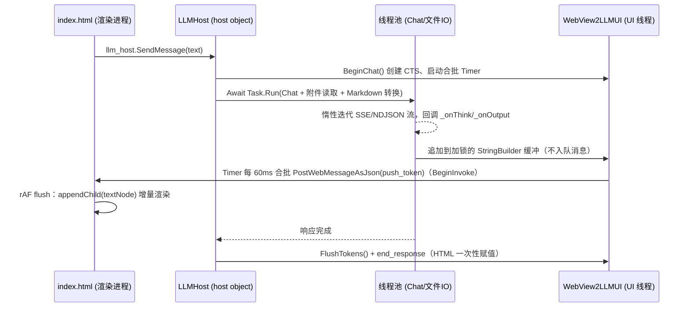

## 产品概述

为 VB.NET WinForms + WebView2 的 LLM 桌面聊天客户端（WebView2UI 项目）做一轮交互与性能改造：把"单文件引用"升级为"多文件会话附件"，在网页端补齐附件的查看/删除/添加入口，在顶栏接入 LLM 的 KV 缓存命中率与 token 用量统计（可点开详情模态框），并修复流式输出时整个界面无法操作的问题。

## 核心功能

1. **多文件会话附件**：同一会话可追加任意数量文件（磁盘文件与内存数据引用共存），按全路径去重；移除其中某一个不影响其余附件；附件在下一次提问时统一注入提示词（已发送的历史内容不追溯修改）。
2. **附件 chip 交互**：输入框上方每个附件显示为一个 chip，文件名是链接（点击查看内容），右侧带"×"删除链接（点击即从会话移除该文件），并有"+ 添加文件"按钮与从资源管理器拖入窗口添加文件的能力。
3. **文件查看（可扩展）**：点击附件名时触发宿主的 `ViewFileRequested` 事件，由外层 WinForms 程序自行决定查看方式；未挂接事件时回退为用系统默认程序打开该磁盘文件；无磁盘路径的内存引用（或文件已丢失）则把文本预览推送到网页模态框展示（超长内容截断）。
4. **顶栏缓存与用量面板**：顶栏"上下文 x / y tokens"旁新增 KV 缓存状态胶囊（后端不支持时显示灰色"不支持"，支持时显示绿色"命中率 xx.x%"），点击弹出模态框，展示会话累计与最近一次请求的 prompt/completion/缓存命中/未命中 token 数与命中率，以及按请求倒序的用量明细表格；模态框打开期间自动刷新、支持 ESC 与点遮罩关闭。
5. **流式输出不再卡界面**：LLM 推理与文件读取整体移到后台线程，token 按可配置间隔（默认 60ms）合批推送，前端改为增量文本节点 + requestAnimationFrame 渲染，滚动尊重用户手动上滑；流式输出过程中界面始终保持可交互（可滚动、可停止、可清空、可增删附件）。

## 技术栈

- 语言/框架：VB.NET，.NET 10（`net10.0-windows`），WinForms（WebView2UI 类库项目，含 WPF 引用）
- 桌面宿主：`Microsoft.Web.WebView2` 1.0.4191.47（WinForms `WebView2` 控件）
- 前端：`index.html`（单文件内联 CSS/JS，无框架依赖，经 `HtmlUiResource.resx` 的 `ResXFileRef` 嵌入，由共享项目 `WebViewLoader.NavigateToLargeString` 以 `https://{guid}.net/` 虚拟域名 + `WebResourceRequested` 方式加载）
- 通信：宿主→网页 `CoreWebView2.PostWebMessageAsJson`；网页→宿主 `AddHostObjectToScript("llm_host", ...)` 的 COM host object（`LLMHost`，`<ClassInterface(AutoDual)><ComVisible(True)>`）
- LLM 后端：`Ollama\LLMClient.vb`（本次不改动，仅读取其统计属性）
- 注意：`GenerateDocumentationFile=True`，新增 Public 成员必须补 XML 注释；`Ollama.CacheUsageMath` 是 `Friend Module`，WebView2UI 侧不可见，命中率一律用 `ChatUsageRecord.HitRate` 或自行计算

## 实现方案

### 1. 多文件附件：拆分"刷新 UI"与"清空列表"

现状 `SetFileReference()` 内部先调 `ClearFileReference()`（该方法会 `fs.Clear()`），导致每次添加都会清空已有附件，永远只剩最后一个文件——这是"只支持单文件"的根因（源码处自带 `TODO: needs fixed`）。

- 保留 `fs As List(Of FileReference)`，把职责拆成：`ClearFileReference()`（清列表 + 清 UI）与 `RefreshFileReference()`（仅重绘 UI）。
- `FileReference` 新增只读 `uid`（`Guid.NewGuid().ToString("N")`）作为前后端主键：既有的 `id`（路径 hash）会写进喂给 LLM 的 `<attached-file id=...>` XML，语义保持不变，避免污染提示词契约。
- 新增批量/去重：`AddFileReference(ParamArray filepaths() As String)`、`AddFileReference(paths As IEnumerable(Of String))`；磁盘文件按全路径大小写不敏感去重；原 `AddFileReference(String)`、`AddFileReference(Func(Of Task(Of String)), String)` 签名保持兼容。
- 新增 `RemoveFileReference(uid)`、`GetFileReference(uid)`、`FileReferencesChanged` 事件。
- UI 下发由"逐条 `ExecuteScriptAsync("set_file_reference(...)")`"改为**单条 `file_refs` 消息整体下发**（`{uid,name,path,size,viewable,on_disk}[]`），页面整体重渲染 chip，消除多次脚本调用造成的闪烁与竞态。
- `ResetConversation` 之后重新下发当前附件列表（原逻辑只清了页面 chip、没清宿主列表，导致"chip 消失但附件仍生效"的不一致）。

### 2. 网页端附件交互

- chip 结构：`📎` 图标 + 文件名 `<a>`（点击 `llm_host.OpenFileReference(uid)`）+ `×` 删除链接（点击 `llm_host.RemoveFileReference(uid)`）；文件缺失时 chip 灰显并给出 tooltip。
- "＋ 添加文件"按钮 → `llm_host.AddFileReferences()`：host object 调用由 WebView2 派发到 UI 线程（STA），可直接弹 `OpenFileDialog`（`Multiselect=True`），选中后回调 `AddFileReference` 并刷新。
- 拖拽添加：**不改 `AllowExternalDrop`（保持 True）**，而是在 `CoreWebView2InitializationCompleted` 里 `AddHandler CoreWebView2.NavigationStarting` 拦截 `file://` 导航 —— `e.Cancel = True` 后把 `New Uri(e.Uri).LocalPath` 加入附件。理由：WebView2 的浏览器子窗口由浏览器进程持有，WinForms 侧的 `DragEnter/DragDrop` 在该区域基本收不到事件；而本页通过虚拟域名 `https://{guid}.net/` 加载，任何 `file://` 导航必然来自拖放，判断无歧义（改 `AllowExternalDrop=False` 反而会丢失拖放来源）。

### 3. 文件查看扩展点

- `Public Event ViewFileRequested(sender As Object, e As FileViewRequestEventArgs)`，`e.File` / `e.Handled`。默认回退：`Process.Start(New ProcessStartInfo(path) With {.UseShellExecute = True})`（try/catch，失败则 `PushError`）。
- 内存引用或磁盘文件不存在 → `FileReference.ReadPreviewText(maxChars)`（默认 200000 字符，大文件只读取头部，避免整读）→ 以 `file_content` 消息推送到网页通用模态框展示，并标注"内容已截断"。
- `FormLLMUI.vb` 示例里挂接该事件，便于验证扩展点。

### 4. 顶栏缓存状态 + 用量模态框

- `PushTokenInfo()` 扩展 `token_update` 消息：在原有 `context_tokens/max_context_tokens` 之外附带 `cache_supported`、`cache_hit_rate`、`last_cache_hit_rate`、`cache_hit_tokens`、`cache_miss_tokens`、`prompt_tokens`、`completion_tokens`（数值保持原始类型，百分比由前端格式化，文化无关）。
- 顶栏新增可点击胶囊：不支持 → 灰色"KV 缓存 不支持"；支持 → 绿色"KV 缓存 命中率 63.2%"，`title="点击查看 token 用量详情"`，hover 有微动效。
- 点击 → `llm_host.GetUsageStats()` 返回 JSON 字符串（host object 返回 `Task(Of String)` 最稳，JS 侧 `JSON.parse`）：模型名、上下文用量、会话累计、最近一次请求、最近 100 条 `cache_usage_log`（倒序）。模态框打开时 2s 轮询刷新、关闭清定时器。
- 统计读取只读属性、成本极低（仅 `_usageLog.ToArray()` 一次拷贝），直接走 UI 线程，不额外开线程。

### 5. 流式卡顿修复（根因已定位）



- **后台线程化**：`LLMHost.SendMessage` 中把「附件读取（文件 IO）+ `llm_host.Chat` + Markdown 转换」整体 `Await Task.Run(...)`；线程池无 `SynchronizationContext`，`ChatRound` 里惰性 `Iterator` 的"边读 socket 边 yield"循环不再回到 UI 线程，UI 线程只负责 `BeginChat`/`PushEnd`。这是卡顿的主因修复。
- **合批推送**：`PushThinkToken/PushOutputToken` 改为加锁追加到两个 `StringBuilder`；由 WinForms `Timer`（UI 线程）按 `TokenFlushInterval`（默认 60ms，范围钳制 10–1000ms，可运行时调整）合批成单条 `push_token` 推送（think、output 各自保序，两者渲染在不同容器，互不要求相对顺序）。`PushStart/PushEnd/PushError` 前先 `FlushTokens()` 保证消息时序。按 60ms 合批可把跨进程消息量从约 50 次/秒降到约 16 次/秒。
- **封送改造**：`SendMessage` 由 `Invoke` 改 `BeginInvoke`（保序且不阻塞后台流线程），并加 `IsDisposed/IsHandleCreated/CoreWebView2 Is Nothing` 守卫，避免释放后崩溃。
- **前端渲染**：`appendToken` 只累积 pending 缓冲并调度一次 `requestAnimationFrame`；flush 时用 `appendChild(document.createTextNode(...))` / `textContent +=` 增量追加，彻底去掉"每 token 一次 `innerHTML = 全文`"的 O(n²) 重解析（顺带消除流式阶段用 innerHTML 渲染纯文本的注入隐患）；`finalizeAssistant` 时才用宿主返回的最终 HTML 一次性赋值。自动滚动改为"仅当用户贴近底部（距底 < 80px）时才滚动"，与 rAF flush 合并执行。
- Timer 通过 `Handles Me.Disposed` 释放，避免隐藏窗口句柄泄漏；`StopChat/结束` 时确保最后一次 flush 与 Timer 停止。

## 实现注意事项（防回归）

- 向后兼容：`AddFileReference` 系列、`ClearFileReference`、`PushThinkToken/PushOutputToken`、`PushStart/PushEnd/PushError` 签名不变；`clear_file_reference()` 保留供 reset 使用，新增 `render_file_references(list)`。
- 消息顺序：`start_response` → `push_token`(think/output) → `end_response` 必须严格有序，合批缓冲的 flush 必须发生在 start/end/error/reset 之前。
- 线程安全：`fs` 列表仅在 UI 线程（host object 调用）变更；token 缓冲用 `SyncLock`；`_cts` 沿用现有生命周期。
- 宿主端异常一律 `PushError` 并 `setBusy(false)`，禁止把异常抛回 COM/JS 造成 Promise 静默失败。
- `Process.Start` 使用 `UseShellExecute=True`，并对路径做白名单校验（仅允许已存在于附件列表中的绝对路径），避免任意路径执行。
- 附件预览读取设置字符上限，禁止整读大文件（沿用 `FileTool.read_file` 的既有约定）。
- 优先不改动 `Ollama` 项目；`Console.Write` 的逐 chunk 输出不影响本次修复，保持不动。

## 架构设计

改动集中在 WebView2UI 项目内，不引入新的架构层次：

- `WebView2LLMUI`（UserControl 代码后置）：宿主状态与消息中枢 —— 附件列表管理、token 合批、统计采集、文件查看事件与默认回退。
- `LLMHost`（COM host object）：网页可调用的门面，只做参数校验 + 转调 `WebView2LLMUI`，并将重活（IO/推理/渲染转换）卸载到线程池。
- `index.html`：纯展示层，新增通用模态框组件（用量统计与文件内容共用）、附件区渲染、流式增量渲染。
- 数据流：网页 →(host object)→ LLMHost →(Task.Run)→ LLMClient →(流式回调)→ WebView2LLMUI 缓冲 →(Timer 合批)→ 网页。

## 目录结构

```
g:\LLMs\src\WebView2UI\
├── FileSystem\
│   ├── FileReference.vb                # [MODIFY] 新增只读 uid（Guid，前后端主键，与写进提示词的 id 解耦）、Overridable onDisk 属性（MemoryReference 返回 False）、ReadPreviewText(maxChars) 预览读取（大文件只读头部并截断）；保持既有 id/size/type/Available/GetFileContent 行为不变
│   └── FileViewRequestEventArgs.vb     # [NEW] ViewFileRequested 事件参数：File As FileReference、Handled As Boolean；宿主应用置 Handled=True 即接管查看行为
├── WebView2LLMUI.vb                    # [MODIFY] 核心：多文件管理（去重/批量/按 uid 移除/RefreshFileReference 与 ClearFileReference 分离/file_refs 消息整体下发）、Public Event ViewFileRequested、默认系统程序打开回退与内存引用推送 file_content、token 合批（TokenFlushInterval + Timer + SyncLock 缓冲 + FlushTokens）、SendMessage 改 BeginInvoke、PushTokenInfo 扩展缓存与 token 字段、GetUsageStatsJson()、NavigationStarting 拦截 file:// 拖放
├── LLMHost.vb                          # [MODIFY] 新增 host object 方法 RemoveFileReference(uid)/OpenFileReference(uid)/AddFileReferences()/GetUsageStats()/GetFileReferences()；SendMessage 内把附件读取、Chat、Markdown 转换整体 Task.Run 到线程池；新增 Public 方法补 XML 注释
├── index.html                          # [MODIFY] 附件区（chip 链接 + × 删除 + ＋添加文件按钮 + 拖放提示）、顶栏 KV 缓存胶囊、通用模态框（用量统计面板/文件内容预览）、流式增量渲染与滚动策略、CSS 补充 chip/链接/模态框/骨架样式
├── FormLLMUI.vb                        # [MODIFY] 示例窗体挂接 ViewFileRequested 事件（并在 Load 中保留既有 SetHost 演示），用于验证扩展点
└── WebView2LLMUI.Designer.vb           # [不改] AllowExternalDrop 保持 True（拖放改由 NavigationStarting 拦截实现，理由见实现方案第 2 点）
```

## 关键代码结构

```
' FileSystem/FileReference.vb —— 新增成员（既有成员保持不变）
Public Class FileReference
    ''' <summary>前后端交互用的稳定唯一标识；与写进提示词 XML 的 <see cref="id"/> 解耦</summary>
    Public ReadOnly Property uid As String = Guid.NewGuid().ToString("N")
    ''' <summary>是否为磁盘文件（内存数据引用返回 False）</summary>
    Public Overridable ReadOnly Property onDisk As Boolean
    ''' <summary>读取用于预览的文本，超过 maxChars 时只取头部并追加截断提示</summary>
    Public Overridable Async Function ReadPreviewText(Optional maxChars As Integer = 200000) As Task(Of String)
End Class

' FileSystem/FileViewRequestEventArgs.vb
Public Class FileViewRequestEventArgs : Inherits EventArgs
    Public ReadOnly Property File As FileReference
    Public Property Handled As Boolean   ' 宿主应用置 True 表示已自行处理查看
End Class

' LLMHost.vb —— 网页可调用的新增 host object 方法（返回 String / Task(Of String) 保证 COM 兼容）
Public Function RemoveFileReference(uid As String) As String
Public Function OpenFileReference(uid As String) As String
Public Function AddFileReferences() As String            ' 弹 OpenFileDialog（Multiselect）
Public Function GetUsageStats() As String                ' 用量统计 JSON（会话累计/最近一次/最近 100 条明细）
Public Function GetFileReferences() As String            ' 当前附件列表 JSON
```

宿主→网页消息契约（沿用 `PostWebMessageAsJson`，均为小写属性名）：

- `token_update`：`context_tokens, max_context_tokens, cache_supported, cache_hit_rate, last_cache_hit_rate, cache_hit_tokens, cache_miss_tokens, prompt_tokens, completion_tokens`
- `file_refs`：`files: [{uid, name, path, size, viewable, on_disk}]`
- `file_content`：`uid, name, content, truncated`（通用模态框展示）
- `push_token`：`type: "think"|"output", text`（合批后的文本片段）
- 其余 `start_response / end_response / error / reset` 语义与字段保持不变

## 设计风格

延续现有 index.html 的蓝白现代简约风格（主色 #2563EB、圆角胶囊与卡片、轻阴影、微动效），在原设计语言上扩展：附件 chip 增加可交互链接态与删除态，顶栏新增状态胶囊，新增居中毛玻璃遮罩模态框（用量统计面板 + 文件内容预览共用一套外壳），保证新增元素与既有页面零违和。

## 页面分块设计（单页，自上而下）

1. **顶栏**：左侧 logo + 标题 + 模型名；右侧依次为「上下文胶囊」「KV 缓存胶囊（新增，可点击，不支持灰、支持绿）」「状态胶囊」「清空按钮」。缓存胶囊 hover 上浮 1px 并显示 tooltip「点击查看 token 用量详情」。
2. **消息区**：保留欢迎页、用户/助手气泡、可折叠思考块；流式阶段光标动效不变，但渲染改为增量追加。
3. **通用模态框（新增）**：半透明遮罩 + 圆角白色面板，标题栏含关闭按钮；用量面板为「概览卡片网格（累计输入/输出/命中/未命中/命中率）+ 最近一次请求行 + 明细表格（时间/模型/输入/输出/命中/未命中/命中率，倒序，可滚动）」；文件内容预览为等宽字体的只读文本块，顶部标注截断提示。
4. **附件区**：chip 列表 + 「＋ 添加文件」按钮；chip 内文件名是蓝色下划线链接（点击查看），右侧灰色「×」（hover 变红，点击移除）；拖放时整页显示虚线高亮边框与「松开以添加文件到会话」提示。
5. **输入区**：保持现有 textarea + 发送/停止按钮；流式期间按钮可点、输入框可用、消息区可自由滚动（上滑后不再强制吸底）。

## 交互与动效

chip 出现/移除带 0.15s 淡入淡出与宽度收缩；模态框 0.2s 缩放淡入；胶囊 hover 有轻微背景加深；所有动效控制在 200ms 内，避免与流式渲染争抢主线程。