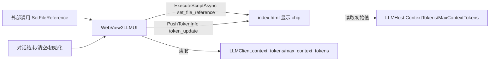

## 用户需求

为 LLM 对话 WinForm 控件（WebView2 + HTML）增加两项 UI 能力，仅修改 WebView2UI 项目，不改动 Ollama/LLMClient.vb。

## 核心功能

- 文件引用展示：在 HTML 输入框上方以只读 chip 形式显示通过 `WebView2LLMUI.SetFileReference` 添加的文件附件；清空对话时一并清除，不提供手动移除按钮。
- 上下文 Token 展示：在顶部栏以文本「上下文 X / Y tokens」显示 `LLMClient` 的 `context_tokens` 与 `max_context_tokens`，并在每次对话结束 / 清空后自动更新。

## 技术栈

- 宿主：VB.NET WinForms + Microsoft.Web.WebView2（CoreWebView2）
- 前端：WebView2 加载的本地 `index.html`（原生 HTML/CSS/JS，无框架）
- 通信：`PostWebMessageAsJson`（VB→HTML 推送）与 `AddHostObjectToScript`（HTML→VB 调用）组成双向桥；既有 `SendMessage(Of T)` 已做 Invoke 跨线程封送
- 数据来源：`WebView2LLMUI.llm_host` 即 `Ollama.LLMClient`，直接读取其 `context_tokens`（ReadOnly Integer）与 `max_context_tokens`（Integer 属性）

## 实现方案

- 文件引用：在 `index.html` 的 composer 上方新增 `#fileRefs` 容器；新增 JS 函数 `set_file_reference(filename)`，向容器追加只读文件名 chip；既有 `reset` 分支顺带清空该容器。`WebView2LLMUI.SetFileReference` 已存在但调用了不存在的 JS 函数，本次补齐该函数，同时修正其脚本参数转义 bug。
- Token 展示：采用「VB 主动推送」而非 HTML 轮询，复用既有 `SendMessage` 推送 `{action:"token_update", context_tokens, max_context_tokens}` 消息，HTML 端 `handleMessage` 新增 `token_update` 分支渲染。该方式避免 JS 异步读取 host object 属性的时序与 Promise 兼容问题，且与现有 start_response/end_response/reset 消息模式一致。
- 初始值：`LLMHost` 新增 `ContextTokens`/`MaxContextTokens` 只读属性（与现有 `Model` 风格一致），`SetHost` 末尾与每次 `PushEnd`/`ResetConversation` 后调用新增的 `PushTokenInfo()` 刷新显示。

## 实现要点

- 修正转义：`SetFileReference` 改用 `JsonSerializer.Serialize(filename)` 生成脚本参数并以 `set_file_reference(<json>)` 形式调用，避免 `filename.GetJson` 产生 `set_file_reference('"xxx.txt"')` 的引号 bug（当前会导致文件名带多余引号）。
- 性能/影响面：仅新增 DOM 节点与一次 JSON 推送，开销可忽略；所有推送复用既有 `SendMessage` 的 Invoke 封送，不改动跨线程逻辑；`LLMClient` 属性为轻量读取（无额外计算），无性能瓶颈。
- 健壮性：`updateTokenDisplay` 对 `max_context_tokens<=0` 做防御（避免 NaN/除零，若使用比例）；`set_file_reference` 对空文件名做忽略处理。

## 架构设计

沿用既有「VB 宿主 ↔ HTML 视图」分层，不改变现有桥接架构：

- HTML 视图层：仅新增展示元素与两个 JS 函数，消息分发仍集中在 `handleMessage`。
- VB 宿主层：`WebView2LLMUI` 作为推送入口，`LLMHost` 作为 HTML 可调用的 host object 属性暴露。



## 目录结构

```
WebView2UI/
├── index.html            # [MODIFY] 新增 #fileRefs 容器与 .file-refs/.file-chip CSS；新增 set_file_reference()、tokenInfo 元素与 updateTokenDisplay()；handleMessage 增加 token_update 分支；reset 分支清空 #fileRefs；DOMContentLoaded 初始读取 token 值
├── WebView2LLMUI.vb      # [MODIFY] 修正 SetFileReference 脚本参数转义；新增 PushTokenInfo() 私助；在 PushEnd / ResetConversation / SetHost 末尾调用 PushTokenInfo()
└── LLMHost.vb            # [MODIFY] 新增 ContextTokens、MaxContextTokens 只读属性（读取 host.llm_host 对应值），供 HTML 初始读取
```

## 关键代码结构

```
' LLMHost.vb 新增（与现有 Model 属性风格一致）
Public ReadOnly Property ContextTokens As Integer
    Get
        If host.llm_host Is Nothing Then Return 0 Else Return host.llm_host.context_tokens
    End Get
End Property

Public ReadOnly Property MaxContextTokens As Integer
    Get
        If host.llm_host Is Nothing Then Return 0 Else Return host.llm_host.max_context_tokens
    End Get
End Property
```