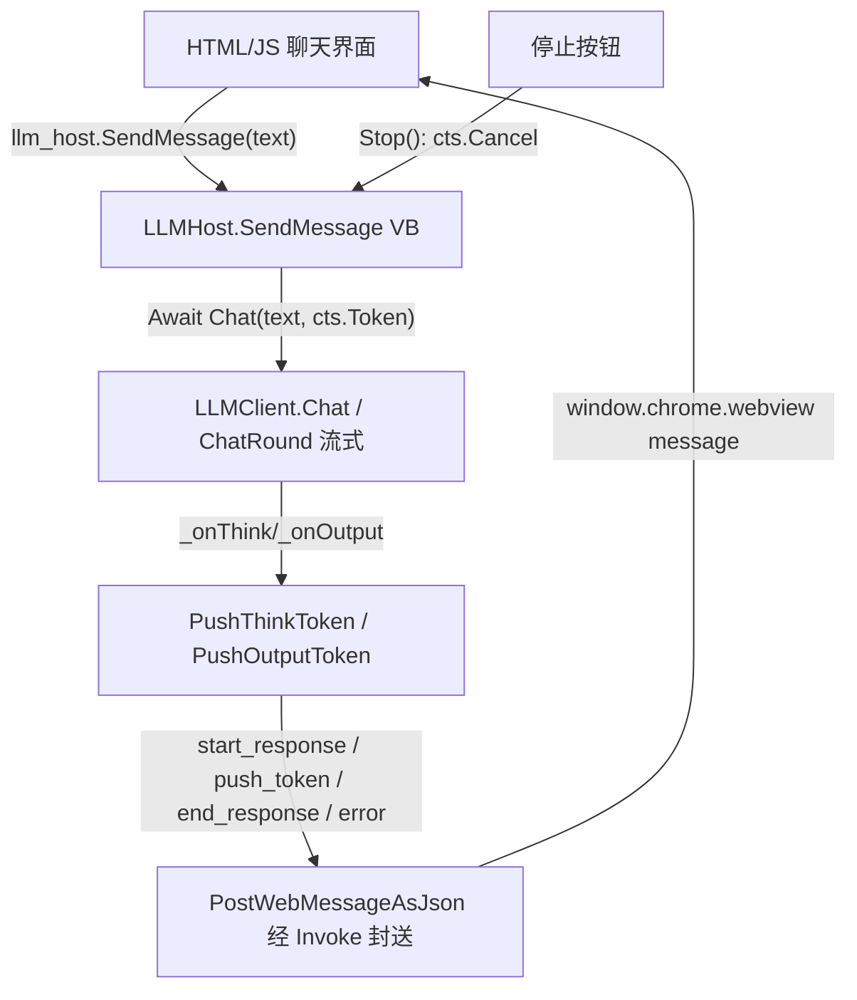

## 用户需求概述

在现有 WebView2UI 项目基础上，封装一个可直接用于 WinForm 的 LLM 聊天控件：控件通过 WebView2 加载内置的 LLM 聊天界面 HTML，并在 VB.NET 代码与 HTML 中的 JavaScript 之间双向互动，实现从 HTML 发送用户消息→VB 端 LLMClient 与 LLM 沟通→以流式 token 方式在 HTML 界面实时显示 LLM 思考（think）与正文（output）的完整链路。

## 核心功能

- HTML 聊天界面：消息列表、输入框、发送按钮、停止（取消）按钮、自动滚动；助手气泡区分可折叠的「思考」与「正文」区域。
- 流式通信：VB 端经 `LLMClient.Chat` 的流式回调（`_onThink`/`_onOutput`）把 token 实时推送到 HTML，JS 增量渲染，无需等待整句完成。
- 会话生命周期信号：一次回复的「开始 / 流式 token / 结束 / 错误」消息，使 JS 能正确新建气泡、填充内容、流结束后恢复输入。
- 取消能力：在对话进行中可点击「停止」中断 `LLMClient.Chat` 的 `CancellationToken`。
- 健壮性：推送在 UI 线程执行；`Chat` 异常时通知页面显示错误；离线运行（HTML/JS/CSS 全部内联，禁止外部 CDN）。
- 易用封装：宿主方法 `SendMessage(text)` 供 JS 调用；提供 `SetHost(llm_host)`、`Stop()` 等供 WinForm 程序集成。

## 技术栈

- 宿主端：VB.NET + WinForms + Microsoft.Web.WebView2（`WebView2LLMUI.vb`），复用外部共享项目 `WebViewHelper.WebViewLoader`（离线虚拟主机名注入 HTML）。
- 前端：单个内联 HTML 文档（`index.html`），内联原生 CSS 与原生 JavaScript；**禁止任何外部 CDN**（离线约束），Markdown 仅做轻量自实现（代码块、换行、基础转义）。
- 资源嵌入：`HtmlUiResource.resx` 通过 `ResXFileRef` 引用 `index.html`，直接编辑 `index.html` 即可生效，无需改 resx。
- 通信：WebView2 `AddHostObjectToScript("llm_host", ...)`（COM 可见对象）+ `PostWebMessageAsJson`（VB→JS）、`chrome.webview.hostObjects.llm_host.SendMessage`（JS→VB）。

## 实现方案

核心策略：在现有 `WebView2LLMUI` 的基础上补齐「一次会话生命周期」的 VB→JS 消息协议，并把 `LLMHost.SendMessage` 改造为「触发流式 Chat、按流推送 token、结束/异常时发信号」的 fire-and-forget 调用；HTML/JS 侧据此维护气泡状态机。

关键技术决策与权衡：

1. **生命周期信号补全流程**：现有仅有 `push_token`，无法区分回复边界。新增 `start_response` / `end_response` / `error` 三类消息，配合 `push_token` 形成完整状态机，使 JS 能正确新建助手气泡、流式填充、结束后恢复输入态。代价是 VB 侧需在 `Chat` 前后各发一次消息，但逻辑清晰、可扩展（如后续 add 工具调用可视化）。
2. **线程安全**：`LLMClient` 的流式回调在 Provider 的网络/异步线程触发，`CoreWebView2.PostWebMessageAsJson` 须在主线程调用。采用 `WebView21.Invoke(Sub() ...)` 兜底封送，避免跨线程异常。
3. **取消**：在 `WebView2LLMUI` 持有 `CancellationTokenSource`；`LLMHost.SendMessage` 调用 `host.llm_host.Chat(prompt, cts.Token)`；新增 `Stop()` 方法 `cts.Cancel()` 并触发新一轮 CTS，使「停止」可中断正在进行的流式生成。`LLMClient.Chat` 已原生支持 `cancellationToken` 参数，无需改动其循环逻辑。
4. **错误兜底**：`Chat` 抛异常时（网络/解析）经 `SendMessage` 发送 `error` 消息，JS 在气泡内展示错误且不卡死输入。
5. **Markdown 自实现**：因离线约束不可用 marked.js，仅实现转义 HTML、代码块（```lang ... ```）基础高亮样式、段落换行，控制体积与可靠性，避免过度设计。

## 实现要点（防止回退）

- **复用既有模式**：沿用现有 `SendMessage(Of T)`（PostWebMessageAsJson）、`HookResponseStream` 回调、`AddHostObjectToScript("llm_host", ...)` 与 `NavigateToLargeString` 初始化流程，不引入新架构。
- **性能**：token 推送为高频小消息，JS 采用「文本累加 + 按需 `textContent` 更新 + 防抖滚动」，避免逐 token 重排整页；`end_response` 用最终完整文本做一次兜底替换，规避增量拼接可能出现的拆分字符。
- **日志/安全**：推送消息仅含文本，不含密钥/PII；异常信息仅透出可读 message，不 dump 大对象。
- **向后兼容**：保留现有 `push_token` 协议字段；新增消息类型对旧 JS 无副作用（旧版忽略未知 `action` 即可）。

## 架构设计



数据流：用户输入 → JS 建用户气泡并调 `SendMessage` → VB 发 `start_response` → `Chat` 流式经回调推 `push_token` → 结束后发 `end_response`（异常发 `error`）→ JS 渲染完成、恢复输入。

## 目录结构

```
g:/LLMs/src/
├── Ollama/
│   └── LLMClient.vb              # [MODIFY] 增加只读属性 Model（返回 _model）供 UI 显示模型名；现有 Chat/ChatRound/HookResponseStream/取消令牌逻辑保持不变。
└── WebView2UI/
    ├── WebView2LLMUI.vb          # [MODIFY] 完善 LLMHost.SendMessage：改为发起 Chat 并在开始/结束/异常时发 start_response/end_response/error；用 Invoke 封送 PostWebMessageAsJson；新增 CancellationTokenSource 与 Stop()、Reset()；新增 PushStart/PushEnd/PushError 辅助方法。
    └── index.html               # [MODIFY] 完整重写：聊天界面结构 + 内联 CSS（现代清爽风格、深色助手气泡、可折叠 think）+ 内联 JS（消息监听状态机、发送/停止、流式增量渲染、自动滚动、轻量 markdown）。通过 HtmlUiResource.resx 的 ResXFileRef 嵌入，无需改 resx。
```

## 关键代码结构（通信协议）

VB→JS 的消息载荷约定（`PostWebMessageAsJson` 的 JSON 字符串）：

- `{"action":"start_response","role":"assistant"}`：JS 新建助手气泡（含 think/output 容器）。
- `{"action":"push_token","type":"think"|"output","text":"..."}`：追加到当前气泡对应容器。
- `{"action":"end_response","output":"...","think":"..."}`：流式结束，用完整文本兜底替换并启用输入。
- `{"action":"error","message":"..."}`：展示错误并恢复输入。

JS→VB：`llm_host.SendMessage(prompt_text)`（COM 异步，fire-and-forget）；可扩展 `llm_host.Stop()`（可选，停止由 VB 按钮触发亦可）。

## 设计风格

采用现代清爽的聊天界面风格（类 ChatGPT/Claude 的简洁布局）。整体为浅色背景 + 圆角卡片气泡，助手消息左侧、用户消息右侧并采用主色高亮区分。顶部为标题栏（显示当前模型名与状态），中部为可滚动消息区，底部为固定输入栏（多行文本框 + 发送/停止按钮）。助手气泡内部分「思考（think）」与「正文（output）」两段，「思考」默认折叠、可点击展开，正文流式实时填充并以光标闪烁提示生成中。全程内联 CSS、无外部依赖。

## 页面区块（自顶向下）

- 顶部标题栏：左侧控件标题与模型名（由 JS 在 start 时填充），右侧状态指示（空闲/生成中）。
- 消息列表区：垂直滚动，用户/助手气泡左右分布；助手气泡内含可折叠 think 区（带「思考过程」标签）与 output 区；自动滚到底部。
- 输入栏：多行自适应文本框（Enter 发送、Shift+Enter 换行）+ 发送按钮；生成中按钮切换为「停止」并触发取消。
- 错误提示：以红色半透明条幅在气泡内或顶部展示异常信息。
- 空状态：无消息时居中显示欢迎语与使用示例。

## 交互与响应式

- 流式 token 增量渲染，生成中显示闪烁光标；结束后光标消失、恢复输入。
- 按钮态随状态切换（发送/停止），禁用态防止重复提交。
- 布局使用 flex 纵向排布，`100%`、`dvh` 自适应控件尺寸；气泡最大宽度限制、长文本自动换行；移动/桌面均可正常显示（控件内嵌）。