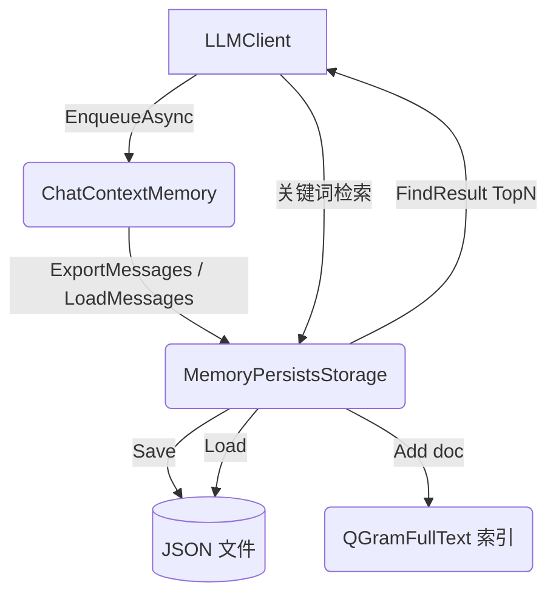

## 用户需求

为基于 VB.NET 的 LLM 客户端（g:/LLMs/src/Ollama）的上下文会话管理模块添加持久化与模糊检索能力。

## 产品概述

在现有 `ContextMemory` 模块内新增一个持久化存储模块，实现会话记忆的落盘保存、文件加载恢复，以及在活跃上下文窗口之外（已被裁剪/压缩的记忆）的基于关键词的全文模糊检索。

## 核心功能

- **会话持久化**：将 `ChatContextMemory` 中的消息列表序列化为本地 JSON 文件，支持覆盖保存与追加写入。
- **会话加载恢复**：从 JSON 文件反序列化为 `List(Of ChatMessage)`，恢复到 `ChatContextMemory` 上下文中，重建队列与 token 估算。
- **全文模糊匹配**：使用 GCModeller 的 `QGramFullText` 引擎，将窗口外记忆建立索引；LLM 通过关键词组检索召回 TopN 相关记忆文档，作为补充上下文返回。
- **索引与文件同步**：加载文件时重建索引；保存/裁剪记忆时增量同步索引，保证查询与落盘数据一致。

## 技术栈选择

- 语言/运行时：VB.NET / .NET 10（沿用 `Ollama.vbproj`，TargetFramework `net10.0`）
- 序列化：`Microsoft.VisualBasic.Serialization.JSON`（项目内已普遍使用 `.GetJson(simpleDict:=True)` 与 `JSONSerializer.LoadObject(Of T)`）
- 全文索引：`Microsoft.VisualBasic.Core` 的 `QGramFullText` / `FindResult`（项目已通过 `Core.vbproj` 引用，命名空间 `ComponentModel.DataSourceModel.Repository`）
- 数据模型：复用 `LLMData.vb` 中的 `ChatMessage`、`ToolCallInfo`

## 实现方案

**总体策略**：在 `ContextMemory` 文件夹内完善 `MemoryPersistsStorage.vb` 作为持久化与索引门面类，同时最小侵入地扩展 `ChatContextMemory`，新增公开方法用于导出/导入消息并同步更新全文索引。

**关键技术决策**：

1. **序列化格式**：采用 `List(Of ChatMessage)` 的 JSON 数组文件，与现有 `ChatMessage` 结构完全兼容，避免引入新模型带来的映射成本。保存使用 `JSONSerializer.GetJson(list, ...)`，加载使用 `JSONSerializer.LoadObject(Of List(Of ChatMessage))`。
2. **索引数据源**：将被裁剪/持久化记忆的每一条消息文本（Content；tool 消息附加 `ToolCalls` 摘要）作为一篇文档调用 `QGramFullText.Add(doc)`。文档与消息通过稳定标识（如列表序号或消息引用）关联，便于命中后回填原文。
3. **公开 API 扩展**：在 `ChatContextMemory` 上新增 `ExportMessages() As List(Of ChatMessage)`（替代私有 `Snapshot` 的对外暴露）与 `LoadMessages(messages As IEnumerable(Of ChatMessage))`（重建队列、重新计算 token、保持工具消息成组），保持现有私有裁剪逻辑不变。
4. **检索召回**：`MemoryPersistsStorage.Search(keywords As IEnumerable(Of String), Optional top As Integer = 5)` 调用 `QGramFullText.Search(queryWords, top)` 返回命中的 `FindResult`（含原文 text 与相似度），供 LLM 注入为补充上下文。
5. **性能与可靠性**：全文索引为内存结构，随记忆规模线性增长；加载文件时一次性重建（O(N)），查询为 QGram 近似匹配（亚线性）。采用 `Try/Catch` 包裹文件读写与反序列化，文件损坏时安全回退为空记忆并保留异常日志，不中断会话。

## 实现要点（执行细节）

- 复用现有 `Imports Microsoft.VisualBasic.Serialization.JSON`，勿引入新第三方库。
- 文件写出使用 `File.WriteAllText` / `WriteAllLines`，路径由构造参数指定，默认落在 `%TEMP%` 或用户指定目录，调用 `MakeDir` 确保目录存在（与 `ChatContextMemory.GetLogFile` 一致）。
- 在 `ChatContextMemory.LoadMessages` 中复用 `EstimateTokens` 与消息成组不变式（tool_calls 与后续 tool 消息成组），避免破坏现有约束。
- 索引与 `_queue` 分离：`MemoryPersistsStorage` 持有 `QGramFullText` 实例，仅索引“窗口外”记忆；活跃窗口始终以 `ChatContextMemory` 队列为准，避免重复注入。
- 日志沿用 `Console.WriteLine` / 现有 `_log` 风格，避免敏感内容（如完整 FunctionArguments）在日志中过度输出。

## 架构设计



## 目录结构

```
g:/LLMs/src/Ollama/ContextMemory/
├── MemoryPersistsStorage.vb   # [MODIFY] 实现持久化与全文检索门面类。包含：Save(messages)、Load()、Search(keywords, top)、
│                              以及内部 QGramFullText 索引的维护（AddDoc/ClearIndex）。构造参数接收文件路径；
│                              提供 SaveToFile/LoadFromFile 与索引同步逻辑，文件损坏时安全回退。
├── ChatContextMemory.vb       # [MODIFY] 新增公开方法 ExportMessages() 返回 List(Of ChatMessage)；
│                              新增 LoadMessages(messages As IEnumerable(Of ChatMessage)) 重建队列与 token 估算，
│                              保持工具消息成组不变式，供 MemoryPersistsStorage 复用。
└── ContextManagementMode.vb   # [不变] 枚举定义已满足需求，无需修改。
```

## 关键代码结构（接口级）

```
' MemoryPersistsStorage 门面（示意签名，非实现）
Public Class MemoryPersistsStorage
    Sub New(filePath As String)
    Public Function Save(messages As IEnumerable(Of ChatMessage)) As Boolean
    Public Function Load() As List(Of ChatMessage)
    Public Function Search(keywords As IEnumerable(Of String), Optional top As Integer = 5) As IEnumerable(Of FindResult)
    Public Sub ClearIndex()
End Class

' ChatContextMemory 新增公开 API
Public Function ExportMessages() As List(Of ChatMessage)
Public Sub LoadMessages(messages As IEnumerable(Of ChatMessage))
```

# Agent Extensions

<subagent>

- **code-explorer**
- 用途：在实施方案前/中确认 `QGramFullText`、`JSONSerializer` 在当前项目引用链中的可用命名空间与重载签名，避免引用或 API 误用。
- 预期结果：输出 `QGramFullText`/`JSONSerializer`/`TextSplit.MakeWords` 的准确 Imports 路径与调用示例，确保编译通过。
</subagent>