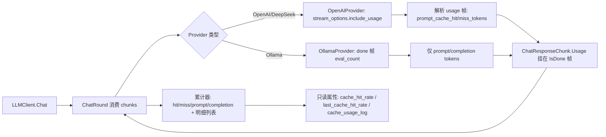

## 产品概述

为 `Ollama` 项目中的 `LLMClient`（VB.NET 大语言模型客户端）增加「会话 KV 缓存命中率」统计能力，使调用方能通过一个只读属性直观获取当前会话的缓存复用效果，便于评估提示词组织是否合理、成本是否被有效节省。

## 核心功能

- **会话累计命中率**：LLMClient 生命周期内，所有请求累计的 `命中 / (命中 + 未命中)` 比例（0~1）。
- **最近一次请求命中率**：最后一次 HTTP 请求的缓存命中比例。
- **Token 明细**：累计与最近一次的 `prompt_cache_hit_tokens`、`prompt_cache_miss_tokens`，以及累计 `prompt_tokens`、`completion_tokens`。
- **每次请求明细列表**：按请求顺序记录每轮的 usage 快照（时间、模型、命中/未命中 token、当次命中率），支持清零重置。
- **后端能力标记**：提供 `cache_supported` 标识当前后端是否支持缓存命中统计；Ollama 本地后端不支持时命中率返回 0。
- **可关闭的 usage 采集**：默认开启（OpenAI 兼容接口自动附加 `stream_options.include_usage`），不支持的端点可安全降级，并允许通过属性关闭。

## 边界与约定

- 数据来自各后端响应的 `usage` 字段（DeepSeek 为 `prompt_cache_hit_tokens` / `prompt_cache_miss_tokens`），仅在流式结束时统计一次，不改变现有对话、工具调用与上下文裁剪行为。
- 命中率分母为 0 或后端不支持时返回 0，不抛异常。

## 技术栈

- 语言/框架：VB.NET，net10.0（SDK 风格项目 `Ollama.vbproj`，自动 glob 编译 `.vb`，`test\` 已排除）
- JSON 解析：项目已在用的 `Microsoft.VisualBasic.MIME.application.json`（`JsonParser` / `JsonObject` / `JsonArray` / `JsonValue`）与 `Microsoft.VisualBasic.Serialization.JSON`
- HTTP：共享 `LLMClient.SharedHttpClient`（SSE / NDJSON 流式读取）
- 不新增任何 NuGet 依赖，沿用 `App.LogException`、`ex.Message.warning` 等现有日志/扩展风格
- 约束：`GenerateDocumentationFile=True`，新增 Public 成员须补 XML 注释，否则产生文档警告

## 实现方案

### 高层策略

在 Provider 层把后端 `usage` 归一化并挂到 `ChatResponseChunk` 上，由 `LLMClient` 在流式消费循环中累计，再以只读属性对外暴露。数据链路：`Provider 解析 usage → ChatResponseChunk.Usage → LLMClient 累计器 → 只读属性/明细列表`。

### 关键技术决策与权衡

1. **usage 挂载点选择在 `IsDone` 帧**：OpenAI/DeepSeek 在开启 `include_usage` 后，usage 单独成帧且 `choices` 为空数组，随后才是 `data: [DONE]`。若把 usage 直接 yield 到独立帧，一旦上游 `If chunk.IsDone Then Exit For` 提前跳出就会漏读。因此采用「`pendingUsage` 暂存 + 在 `[DONE]` 帧（及流异常结束的兜底帧）统一挂载」的方式，与既有 `Exit For` 语义天然兼容，采集零遗漏。
2. **必须修复的空 `choices` 解析缺陷**：现有 `ParseOpenAIStream` 中 `DirectCast(DirectCast(result("choices"), JsonArray)(0), JsonObject)("delta")` 在 usage 帧（choices 为空数组）上必然抛异常，这是开启 usage 后引入的直接回归点，必须先判空再取 `delta`。
3. **单帧解析加 Try/Catch 隔离**：不同兼容端点帧结构存在差异，坏帧不应中断整次对话。坏帧静默跳过，仅在 `DEBUG` 下记录日志，避免日志噪音（当前代码无 try/catch，一处坏帧即整轮失败，属必要的健壮性修复）。
4. **接口新增 `SupportsCacheStats`**：相比在 `LLMClient` 中用 `TypeOf _provider Is OpenAIProvider` 做类型嗅探，接口属性更符合开放封闭原则且可扩展到未来后端。代价是接口的破坏性变更——已全仓验证 `Implements ILLMProvider` 仅 `OpenAIProvider`、`OllamaProvider` 两处（`LLMUrl.vb` 工厂创建、`Agent/OLlama.vb`、`WebView2UI/FormLLMUI.vb` 均为消费方，不实现接口），改动可控。
5. **Ollama 不伪造缓存数据**：Ollama 无 KV 缓存命中字段，仅在 `done` 帧解析 `prompt_eval_count` / `eval_count` 作为 prompt/completion token 统计，缓存字段保持 `Nothing`，由 `SupportsCacheStats=False` 与 `HasCacheStats` 双重判定后命中率返回 0。
6. **统计口径**：一轮 `Chat()` 可能包含多次 HTTP 请求（工具调用轮次 + 重试），"最近一次"指最近一次 HTTP 请求；"会话累计"指 LLMClient 实例生命周期累计，`Clear()` 只清上下文记忆、不清统计，另提供 `ResetCacheStats()` 显式清零（最小惊讶原则）。

### 性能与可靠性

- 采集为 O(1) 增量累加，明细列表按请求追加（每次 HTTP 请求 1 条），对流式热路径无可感知开销。
- 明细列表设置上限（如 1000 条，超出丢弃最旧），避免长时间 Agent 会话无界增长；累计值用 `Long` 防溢出（对齐 `ChatContextMemory._estimatedTokens` 的 Long 用法）。
- 统计不做加锁（与现有 `_calls`、`_context` 一致，KISS），在注释中说明并发调用下统计不保证精确。
- 端点不支持 `stream_options` 时返回 400，会触发 `EnsureSuccessStatusCode()` 抛错并进入现有重试循环；通过 `enable_usage_stats` 开关可一键降级，保证向后兼容。

## 实现注意事项（执行细节）

- **不要改动** `g:\LLMs\src\LLMClient.vb`（根目录、Namespace `LLMSdk`、Newtonsoft 的独立旧文件，与本工程无关）。
- `ChatRound` 中累计 usage 的代码必须写在 `If chunk.IsDone Then Exit For` **之前**，否则统计永远为 0。
- OpenAI 请求体仅在 `options.StreamUsage` 为真时追加 `stream_options`，避免影响既有严格端点。
- usage 数值解析统一用 `Long.TryParse` 容错，缺失字段视为 0 / `Nothing`，不抛异常。
- 新增 Public 成员全部补齐 XML 注释（工程开启文档生成）。
- 命名风格：`LLMData.vb` 内新类型用 PascalCase（`ChatUsage` / `ChatUsageRecord`），`LLMClient` 新属性沿用现有小写下划线风格（`context_tokens`、`system_message`）。

## 架构设计

### 数据流



### 命中率计算

- `rate = If(hit + miss > 0, hit / (hit + miss), 0.0)`
- 后端不支持或 usage 缺失缓存字段时返回 `0.0`

## 目录结构

本次改动全部位于现有工程 `g:\LLMs\src\Ollama`，不新增文件目录，仅扩展现有类型。

```
g:\LLMs\src\Ollama\
├── LLMData.vb                # [MODIFY] 新增 ChatUsage（归一化 usage：PromptTokens / CompletionTokens / CacheHitTokens / CacheMissTokens / HasCacheStats / Raw）与 ChatUsageRecord（每请求明细快照：TimeStamp / Model / 各类 token / HitRate）；为 ChatResponseChunk 增加 Usage 属性；为 ChatRequestOptions 增加 StreamUsage 开关字段（默认 True）
├── ILLMProvider.vb           # [MODIFY] 接口新增只读属性 SupportsCacheStats，用于标识后端是否提供 KV 缓存命中统计
├── OpenAIProvider.vb         # [MODIFY] 请求体按 StreamUsage 追加 stream_options.include_usage；修复 usage 帧 choices 为空数组导致的解析异常；解析 usage 并在 [DONE] 帧（含流异常结束兜底）挂载 ChatUsage；单帧解析 Try/Catch 隔离坏帧；SupportsCacheStats 返回 True
├── OllamaProvider.vb         # [MODIFY] 在 done 帧解析 eval 指标生成 ChatUsage（仅 prompt/completion token，缓存字段留空）；SupportsCacheStats 返回 False
├── JSON\ResponseBody.vb      # [MODIFY] 增加 Ollama done 帧的 prompt_eval_count / eval_count 可空字段，供 usage 统计使用
└── LLMClient.vb              # [MODIFY] 主改造目标：新增 enable_usage_stats 开关、累计器字段、RecordUsage 累计逻辑（ChatRound 内 IsDone 判定之前）、cache_supported / cache_hit_rate / last_cache_hit_rate / cache_hit_tokens / cache_miss_tokens / last_cache_hit_tokens / last_cache_miss_tokens / prompt_tokens / completion_tokens / cache_usage_log 只读属性，以及 ResetCacheStats 清零方法
```

## 关键代码结构

### 归一化 usage 与明细记录类型（LLMData.vb 新增）

```
''' <summary>归一化的 token 用量统计（缓存字段仅在后端支持时才有值）</summary>
Public Class ChatUsage
    Public Property PromptTokens As Long
    Public Property CompletionTokens As Long
    ''' <summary>缓存命中的输入 token 数；后端不支持时为 Nothing</summary>
    Public Property CacheHitTokens As Long?
    ''' <summary>缓存未命中的输入 token 数；后端不支持时为 Nothing</summary>
    Public Property CacheMissTokens As Long?
    ''' <summary>是否包含可用的缓存命中统计（Hit 与 Miss 均有值）</summary>
    Public ReadOnly Property HasCacheStats As Boolean
    ''' <summary>原始 usage 对象，便于兼容未来新增字段</summary>
    Public Property Raw As Object
End Class

''' <summary>单次请求的用量快照，用于会话级明细列表</summary>
Public Class ChatUsageRecord
    Public Property TimeStamp As DateTime
    Public Property Model As String
    Public Property PromptTokens As Long
    Public Property CompletionTokens As Long
    Public Property CacheHitTokens As Long
    Public Property CacheMissTokens As Long
    ''' <summary>本次请求命中率：hit/(hit+miss)，分母为 0 时为 0</summary>
    Public ReadOnly Property HitRate As Double
End Class
```

### LLMClient 对外契约（命名沿用现有小写下划线风格）

```
''' <summary>当前后端是否提供 KV 缓存命中统计（Ollama 为 False）</summary>
Public ReadOnly Property cache_supported As Boolean
''' <summary>是否在流式请求中向后端索取 usage 统计（默认 True，可关闭以兼容不支持的端点）</summary>
Public Property enable_usage_stats As Boolean
''' <summary>会话累计缓存命中率 0~1；不支持或分母为 0 时返回 0</summary>
Public ReadOnly Property cache_hit_rate As Double
''' <summary>最近一次请求的缓存命中率 0~1</summary>
Public ReadOnly Property last_cache_hit_rate As Double
Public ReadOnly Property cache_hit_tokens As Long
Public ReadOnly Property cache_miss_tokens As Long
Public ReadOnly Property last_cache_hit_tokens As Long
Public ReadOnly Property last_cache_miss_tokens As Long
Public ReadOnly Property prompt_tokens As Long
Public ReadOnly Property completion_tokens As Long
''' <summary>按时间顺序的每次请求用量明细快照（返回副本）</summary>
Public ReadOnly Property cache_usage_log As ChatUsageRecord()
''' <summary>清零累计统计与明细列表（不影响对话上下文与 Clear 行为）</summary>
Public Function ResetCacheStats() As LLMClient
```

### OpenAI usage 帧处理要点（OpenAIProvider.ParseOpenAIStream）

```
对每帧 data：
  若 data = "[DONE]"：构造 IsDone 帧，附加 pendingUsage 与已拼装的 tool_calls，Yield 后退出
  否则解析 JsonObject：
    仅当 HasObjectKey("choices") 且数组非空时，才取 choices(0)("delta") 走现有增量解析
    若 HasObjectKey("usage")：解析 prompt_tokens / completion_tokens /
       prompt_cache_hit_tokens / prompt_cache_miss_tokens（Long.TryParse 容错），暂存到 pendingUsage
  单帧解析异常：DEBUG 下记录日志后跳过，不中断整轮流
```

## Agent Extensions

### Skill

- **lsp-code-analysis**
- Purpose: 在改动 `ILLMProvider` 接口与 `ChatResponseChunk` 后，精确查找 `StreamChatAsync`、`ChatResponseChunk`、`ILLMProvider` 的全部定义与引用点，确认无遗漏调用方，并预览受影响范围
- Expected outcome: 确认接口新增成员与结构体扩展不破坏仓库内任何消费方（`LLMUrl.vb`、`Agent/OLlama.vb`、`WebView2UI/FormLLMUI.vb`、`test/DemoUsage.vb`）