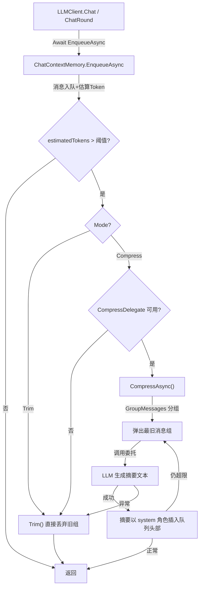

## 用户需求

为 ChatContextMemory 上下文记忆管理模块新增「上下文压缩」功能，作为现有 Trim（直接丢弃旧消息）模式的替代方案。

### 核心功能

- **双模式切换**：通过一个枚举参数在现有的 Trim（直接丢弃旧消息）和新增的 Compress（LLM 摘要压缩）两种模式之间随时切换，默认为 Trim 以保证向后兼容
- **LLM 摘要压缩**：当上下文 Token 接近上限时，弹出较早的消息组，通过外部注入的委托回调调用一个新 LLM 实例将旧对话总结为一篇摘要文本，用摘要替代原始消息以减少 Token 占用
- **消息组保留**：压缩时沿用 Trim 已有的分组逻辑——assistant(tool_calls) 与其紧随的 tool 结果消息视为一组整组弹出，避免产生孤立的 tool 消息
- **可配置触发阈值**：设定压缩触发阈值（默认 MaxTokens 的 85%），在达到硬上限前提前压缩，留出缓冲空间
- **安全兜底**：压缩委托未配置或 LLM 调用失败时自动回退为 Trim 模式

### 视觉效果

无 UI 变化，纯后端逻辑增强。

## 技术栈

- 语言：VB.NET
- 异步模型：Async/Await (Task)
- 项目类型：.NET 类库（Ollama.vbproj）
- 无新增外部依赖，完全复用现有基础设施

## 实现方案

### 整体策略

采用**委托注入模式**解耦 LLM 依赖：`ChatContextMemory` 通过 `Func(Of List(Of ChatMessage), Task(Of String))` 委托接收外部 LLM 摘要能力，避免与 `LLMClient` 产生循环依赖。原 `Enqueue` 方法改为 `EnqueueAsync`，入队后根据模式异步执行 Trim 或 Compress。

### 架构设计



### 目录结构

仅修改现有文件，不新增文件：

```
g:/LLMs/src/Ollama/
├── ChatContextMemory.vb    # [MODIFY] 核心模块
│   - 新增 ContextManagementMode 枚举 (Trim / Compress)
│   - 新增 Mode 属性 (默认 Trim)
│   - 新增 CompressionDelegate 属性：Func(Of List(Of ChatMessage), Task(Of String))
│   - 新增 CompressionThreshold 属性 (Double, 默认 0.85)
│   - 提取 GroupMessages() 方法：复用分组逻辑
│   - Enqueue → EnqueueAsync：入队后根据 Mode 调用 Trim 或 CompressAsync
│   - 新增 CompressAsync()：弹出旧组→调委托→插入摘要→重建队列
│   - 保留原 Trim() 不变，作为 Compress 的安全兜底
│
├── LLMClient.vb            # [MODIFY] 调用方适配
│   - 5 处 _context.Enqueue(...) → Await _context.EnqueueAsync(...)
│   - 可选暴露上下文模式/压缩委托的配置入口
```

### 关键代码结构

```
' === ChatContextMemory.vb 新增类型和成员 ===

Public Enum ContextManagementMode
    Trim
    Compress
End Enum

' 新增属性
Public Property Mode As ContextManagementMode = ContextManagementMode.Trim
Public Property CompressionDelegate As Func(Of List(Of ChatMessage), Task(Of String))
Public Property CompressionThreshold As Double = 0.85

' EnqueueAsync 替代原 Enqueue
Public Async Function EnqueueAsync(msg As ChatMessage) As Task

' 提取的分组方法
Private Shared Function GroupMessages(list As List(Of ChatMessage)) As List(Of List(Of ChatMessage))

' 新增压缩方法
Private Async Function CompressAsync() As Task
```

### 实现要点

- **分组逻辑复用**：将现有 Trim 中的消息分组代码提取为 `GroupMessages(list)` 静态方法，Trim 和 CompressAsync 共用
- **性能**：`EnqueueAsync` 在普通入队时同步返回（不触发压缩），仅达阈值时 await LLM 调用；压缩为低频操作，不影响正常对话性能
- **级联压缩**：一次压缩后若仍超阈值，循环继续弹出并压缩下一组
- **向后兼容**：Mode 默认 Trim，CompressionDelegate 默认 Nothing；不配置压缩参数时行为与原有完全一致
- **异常安全**：CompressAsync 内 try-catch，失败时自动回退 Trim 保证队列一致性