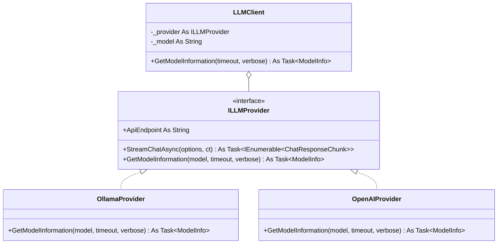

## 用户需求

重构 `LLMClient.GetModelInformation` 函数，使其不再局限于 Ollama 后端，能够同时支持 Ollama 与 OpenAI 两种后端获取当前模型信息。

## 产品概述

将原先只兼容 Ollama 的模型信息获取能力，改造为统一的、后端无关的接口。调用方通过 `LLMClient.GetModelInformation` 即可获得归一化后的模型信息对象，无需关心底层是 Ollama 还是 OpenAI。

## 核心特性

- 在统一的 `ILLMProvider` 接口中新增 `GetModelInformation` 方法，由 `OllamaProvider` 与 `OpenAIProvider` 各自实现后端差异。
- `LLMClient.GetModelInformation` 仅做委托转发，返回统一的归一化模型信息类 `ModelInfo`。
- Ollama 端：复用 `POST /api/show` 请求获取详情并映射字段。
- OpenAI 端：使用 `GET /v1/models/{model}` 并携带 `Bearer` 鉴权头获取模型信息并映射字段。
- 对外返回结构一致的 `ModelInfo`，包含模型标识、来源后端、家族、参数量、量化等级、拥有者、时间戳等归一化字段。

## 技术栈

- 语言：VB.NET（.NET，与现有项目一致）
- JSON 解析：复用 `Microsoft.VisualBasic.MIME.application.json.Javascript`（JsonParser / JsonObject）
- HTTP：复用 `LLMClient.SharedHttpClient` 静态实例
- 架构模式：Provider 策略模式（与现有 `StreamChatAsync` 一致）

## 实现方案

### 总体策略

采用「接口扩展 + Provider 各自实现」策略：在 `ILLMProvider` 中新增 `GetModelInformation` 方法，将各后端的请求构造、鉴权、响应解析封装在对应 Provider 内；`LLMClient.GetModelInformation` 退化为轻量委托层，仅把 `_model`、`timeout`、`verbose` 透传给当前 Provider 并返回归一化后的 `ModelInfo`。

### 关键技术决策

1. **扩展接口而非在 Client 内分支**：OpenAI 的模型信息接口需要 `Bearer` 鉴权头，而 `apiKey` 仅 `OpenAIProvider` 持有，`LLMClient` 无法访问。因此鉴权与请求逻辑必须下沉到 Provider 内部（这也是现有 `StreamChatAsync` 的既有模式，保持一致、符合 SoC）。
2. **返回统一 `ModelInfo` 类**：原始字段差异大（Ollama 含 `details.family/parameter_size/quantization_level`，OpenAI 含 `owned_by/created`），归一化后可让调用方免感知后端，同时保留 `Raw As JsonObject` 供深入解析。
3. **复用现有约定**：Ollama 端继续复用 `RequestShowModelInformation` 作为请求体，URL 推导沿用现有 `ApiEndpoint.Replace("/api/chat", "/api/show")`；超时沿用 `CancellationTokenSource(TimeSpan.FromSeconds(timeout))` 的既有写法。

### 性能与可靠性

- 仅单次 HTTP 请求，无 N+1、无额外遍历；超时由 `CancellationTokenSource` 控制，避免长阻塞。
- 错误处理与现有代码一致：使用 `response.EnsureSuccessStatusCode()`，异常向上传播，不在新代码中吞掉错误。
- 向后兼容：`LLMClient.GetModelInformation` 对外签名 `(Optional timeout As Double = 1, Optional verbose As Boolean = True)` 保持不变，仅返回类型由 `JsonObject` 改为 `ModelInfo`。

## 实现注意点

- Ollama：`ApiEndpoint` 为 `http://{server}/api/chat`，需替换为 `/api/show` 后 `POST`，请求体为 `RequestShowModelInformation{model, verbose}`。
- OpenAI：`ApiEndpoint` 为 `{base}/v1/chat/completions`，需替换为 `{base}/v1/models/{model}` 后 `GET`，**必须**加 `Authorization: Bearer {_apiKey}`；`model` 直接作为路径段。
- `verbose` 对 OpenAI 无对应语义，保留参数仅用于签名对齐，OpenAI 实现中忽略。
- `ModelInfo.CreatedAt`：OpenAI 取 `created`（Unix 秒，Long）；Ollama 尝试解析 `modified_at`（ISO 字符串）转 Unix，解析失败置 `Nothing`。
- 不改动 `StreamChatAsync`、记忆、工具调用等任何无关逻辑，控制改动范围。

## 架构设计



调用链：`LLMClient.GetModelInformation → _provider.GetModelInformation(_model, timeout, verbose) → OllamaProvider(Post /api/show) 或 OpenAIProvider(Get /v1/models/{id} + Bearer) → 映射为 ModelInfo`

## 目录结构与改动文件

```
g:/LLMs/src/Ollama/
├── ILLMProvider.vb        # [MODIFY] 在 ILLMProvider 接口新增 GetModelInformation 方法声明；同文件新增统一 DTO 类 ModelInfo（与 ChatMessage/ChatResponseChunk 等共享 DTO 的现有约定一致，集中放置）。
├── OllamaProvider.vb      # [MODIFY] Implements ILLMProvider.GetModelInformation：用 ApiEndpoint 推导 /api/show，POST RequestShowModelInformation，解析 JsonObject 并映射为 ModelInfo（Ollama 特有字段：family/parameter_size/quantization_level/format）。
├── OpenAIProvider.vb      # [MODIFY] Implements ILLMProvider.GetModelInformation：用 ApiEndpoint 推导 /v1/models/{model}，GET 并加 Bearer 鉴权，解析 JsonObject 映射为 ModelInfo（id→Id, owned_by→OwnedBy, created→CreatedAt, Provider="openai"）。
└── LLMClient.vb           # [MODIFY] 将 GetModelInformation 改为委托 _provider.GetModelInformation(_model, timeout, verbose)，去掉 TypeOf 判断与本地 HTTP 逻辑，返回类型改为 Task(Of ModelInfo)。
```

## 关键代码结构

```
' ILLMProvider.vb 中新增的统一模型信息 DTO（与现有 ChatMessage 等 DTO 同文件）
Public Class ModelInfo
    Public Property Id As String                 ' 模型标识（Ollama: name，OpenAI: id）
    Public Property Provider As String           ' 后端来源："ollama" / "openai"
    Public Property Family As String             ' 模型族（Ollama: details.family）
    Public Property ParameterSize As String      ' 参数规模（Ollama: details.parameter_size）
    Public Property QuantizationLevel As String  ' 量化等级（Ollama: details.quantization_level）
    Public Property Format As String             ' 格式（Ollama: details.format）
    Public Property OwnedBy As String            ' 拥有者（OpenAI: owned_by）
    Public Property CreatedAt As Long?           ' 创建/修改时间戳（Unix 秒）
    Public Property Raw As JsonObject            ' 原始响应，供调用方深入解析
End Class

' ILLMProvider 接口新增方法签名
Function GetModelInformation(model As String, timeout As Double, verbose As Boolean) As Task(Of ModelInfo)
```