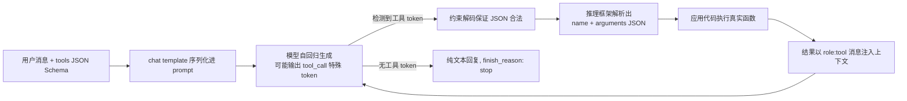

LLM（大语言模型）的本质，是一个基于 **Transformer 解码器架构、通过海量文本进行"下一个词预测"训练出来的自回归概率模型**——它把语言建模为条件概率链，再通过对齐训练学会"听话地"续写。下面沿着"整体架构 → 注意力核心 → 训练流程 → 推理生成 → 进阶方向"这条主线展开。
---
## 一、核心思想：语言建模 = 链式条件概率
一段文本 $w_1, w_2, \dots, w_L$ 的概率可以按链式法则分解为：
$$P(w_1, \dots, w_L) = \prod_{t=1}^{L} P(w_t \mid w_1, \dots, w_{t-1})$$
LLM 的任务就是学会这个条件分布：给定前文，预测下一个 token。这一目标极其简单，却迫使模型在万亿级语料上"做无数遍完形填空"，从而被迫掌握语法、事实知识、逻辑推理与写作风格——因为这些都能降低预测误差。
## 二、整体架构：Transformer 解码器堆叠
一个典型的 LLM（如 GPT、Llama）由以下模块自底向上组成：
**1. Tokenization 与 Embedding**
文本先被切分为 token（子词单元），每个 token 通过查找表映射为一个 $d$ 维向量（常见 $d$ 为 4096 甚至更大），词表通常在 3 万到 20 万之间。
**2. 位置编码**
自注意力本身是置换不变的——打乱输入顺序，输出也跟着打乱，模型天然不知道词序。因此必须显式注入位置信息，常见三种方案：
- **正弦绝对编码**（原始 Transformer）：给每个位置加一个固定的 sin/cos 向量 $PE(t, 2i) = \sin(t/10000^{2i/d})$，直接加到嵌入上，外推能力差；
- **RoPE（旋转位置编码）**：不改嵌入，而是对 Q、K 向量按位置做旋转，第 $2i$ 与 $2i{+}1$ 维旋转角度为 $t\omega_i$。巧妙之处在于点积 $q_m \cdot k_n$ 只依赖于相对距离 $m-n$，天然编码相对位置。Llama、Qwen、Mistral、DeepSeek 等主流模型均采用 RoPE；
- **ALiBi**：直接在注意力分数上加线性惩罚 $-m_h \cdot |i-j|$，近处 token 加分、远处扣分，实现最简单，外推能力强。
**3. 多头自注意力**
模型的核心，下一节详细拆解。
**4. 前馈网络（FFN）**
注意力之后接一个逐位置的两层 MLP（中间层通常放大 4 倍，现代模型多用 SwiGLU 等门控激活）。注意力负责"跨 token 混合信息"，FFN 负责"对每个位置的表示做深度非线性变换"，有研究认为 FFN 层存储了大量事实知识。
**5. 层堆叠与残差连接**
"多头注意力 + FFN"构成一个 Transformer 层（block），LLM 通常堆叠 32 到 120+ 层。每层配合残差连接和归一化（现代模型多用 RMSNorm，且常采用 Pre-Norm 即先归一化再进子层），信息通过残差通路逐层精炼，最终经过线性层 + softmax 输出整个词表上的概率分布。
---
## 三、注意力机制：LLM 的灵魂
### 3.1 Q、K、V 三个投影的直觉
对于输入矩阵 $X \in \mathbb{R}^{n \times d}$（$n$ 个 token），每个注意力头先做三个可学习的线性投影：
$$Q = XW_Q, \quad K = XW_K, \quad V = XW_V$$
三个角色的直觉是：**Query 是"我在找什么"，Key 是"我能提供什么匹配"，Value 是"我实际贡献什么信息"**。这些角色由训练学出，而非人为编程指定。
### 3.2 缩放点积注意力
$$\text{Attention}(Q, K, V) = \text{softmax}\!\left(\frac{QK^\top}{\sqrt{d_k}} + M\right)V$$
逐项理解：
- $QK^\top$：$n \times n$ 的注意力分数矩阵，第 $(i,j)$ 项衡量位置 $i$ 对位置 $j$ 的关注强度（本质是嵌入空间中的相似度）；
- 除以 $\sqrt{d_k}$：防止高维点积数值过大导致 softmax 进入饱和区、梯度消失；
- $M$（掩码）：在 GPT 类因果解码器中，将 $j > i$ 的位置设为 $-\infty$，softmax 后权重为 0，保证第 $i$ 个 token 只能看到自己和之前的位置——这是自回归生成的前提；
- 乘以 $V$：每一行的输出是该行所有可见位置 value 向量的凸组合（加权和），形成融合了上下文的新表示（context vector）。
### 3.3 为什么多头
单个注意力头只能学习一种"关注模式"。多头机制将 $d$ 维空间切分为 $h$ 个子空间（如 32 个头，每头 128 维），各自独立做注意力再拼接，让模型同时在不同子空间捕捉不同类型的依赖（句法、指代、语义关联等）。
**注意力机制的核心优势在于：任意两个位置之间的信息传递路径长度为 1（单层即可直接交互），彻底解决了 RNN 的长程依赖衰减问题，并且训练时可以完全并行**——这是 Transformer 取代循环网络的根本原因。
---
## 四、训练流程：从"会说话"到"会对话"
LLM 不是一步训成的，而是经历多阶段流水线，每个阶段解决不同问题、顺序不可颠倒。
### 阶段 1：预训练→ 获得"语言能力"
在万亿级 token 的网络文本、代码、书籍上做自回归下一个词预测，损失函数为：
$$\mathcal{L}_{\text{PT}} = -\sum_{t=1}^{T} \log P_\theta(x_t \mid x_{<t})$$
这一步消耗了 99% 的算力（如 Llama 3 405B 用了 16000 张 H100 训练 54 天），产出 **Base Model**——擅长续写但不听指令。直接问它"写一首关于拉各斯的诗"，它可能续写成"拉各斯是尼日利亚人口最多的城市……"，因为在它眼里这只是文本补全。
### 阶段 2：监督微调 SFT → 教会"听话"
用人工标注的高质量"指令—回复"对（约 1 万到几十万条）继续训练，仍是下一个词预测损失，但数据量小、质量高。产出会按指令格式回答的 Instruct 模型。
### 阶段 3：RLHF / 偏好对齐 → 让回答"优秀且无害"
- **奖励模型 RM**：人类标注员对同一 prompt 的多个输出排序（约 5 万–30 万条偏好对），训练一个打分模型；
- **强化学习优化**：用 PPO 更新 LLM，使其输出在奖励模型上得分更高，同时用 KL 散度惩罚约束模型不要偏离 SFT 版本太远：$J = \mathbb{E}[R(x,y) - \beta \cdot \text{KL}(\pi_\theta \| \pi_{\text{ref}})]$；
- **DPO（直接偏好优化）**：一种更简单的替代方案，跳过显式奖励模型和 RL 循环，直接从偏好数据对上用闭式损失优化策略，被 Zephyr、Llama 3 等开源模型广泛采用；DeepSeek-R1 则使用 GRPO 变体来训练推理能力。
三阶段缺一不可：没有预训练，SFT 学不会指令格式；没有 SFT 直接 RLHF，基座输出太随机，奖励信号无法收敛；只有前两步没有对齐，模型会停留在"及格线"水平且可能输出有害内容。
---
## 五、推理生成：自回归解码
### 5.1 一个 token 一个 token 地生成
推理时模型逐 token 输出：每轮前向传播产生词表上的 logits，经采样策略选出下一个 token，拼回输入再继续，直到 EOS。
### 5.2 KV Cache：避免重复计算
朴素实现下每生成一个新 token 都要重算所有历史位置的 K、V，代价是 $O(t^2)$。KV Cache 的关键观察是：**已生成 token 的 K、V 在后续步骤中不变**，可以缓存复用——每步只需计算新 token 的 $Q, K, V$ 并拼接缓存，将单步开销降为 $O(t)$。代价是显存占用随序列长度线性增长（这也是长上下文推理的瓶颈，Multi-Query Attention 等技术可压缩 8–16 倍缓存）。
### 5.3 采样策略
logits 变成概率再选 token 有多种方式，共同决定生成风格的"创造性 vs 精确性"：
- **温度**：先对 logits 除以 $\tau$ 再 softmax。$\tau \to 0$ 退化为贪心；$\tau > 1$ 分布变平坦、更随机；
- **Top-k**：只从概率最高的 k 个 token 中采样；
- **Top-p（核采样）**：只从累计概率达到 p 的最小 token 集合中采样，随分布形状自适应，通常比固定 k 更自然。
---
## 六、进阶方向：走向更大规模与更长上下文
**混合专家 MoE**：将 FFN 替换为若干个并行的"专家网络"+ 一个路由器（Router）。每个 token 只被路由到 Top-1 或 Top-2 个专家（如 8 选 2），使得**总参数量可以做得很巨大（知识容量大），而每个 token 的实际计算量只激活一小部分**，兼顾容量与推理成本。Mixtral、DeepSeek-V3 等均采用此设计。
**长上下文扩展**：在 RoPE 基础上做外推，如 NTK-aware 缩放、YaRN、LongRoPE 等，通过调整旋转基数让模型在少量微调（甚至免微调）下从 8K 扩展到 128K 乃至 1M 上下文，Llama 3 与 Qwen2 的长上下文版本即靠此类技术实现。
**推理加速**：除 KV Cache 外，还有量化（GPTQ/AWQ 将 16 位权重压到 4/8 位整数）、投机解码（小草稿模型先生成若干 token，大模型并行验证）等工程手段。
---
## 小结
把整条链路串起来：**文本 → token → 嵌入加位置信息 → 多层"因果自注意力 + FFN"（注意力负责跨位置混合信息，FFN 负责逐位置非线性变换与知识存储）→ 词表概率分布 → 采样出下一个 token → 拼回输入继续生成**。训练上走"预训练获得能力 → SFT 学会格式 → RLHF 对齐偏好"三步，推理上靠 KV Cache 和各种采样策略控制效率与多样性。Transformer 之所以成为基石，正是因为自注意力让任意距离的信息交互路径长度为 1、训练完全可并行，而"预测下一个词"这一极简目标在足够规模的数据和参数下涌现出了今天所见的通用语言能力。

DeepSeek MoE 的核心设计可以一句话概括：**在 Transformer 的 FFN 层上，用"细粒度专家分割 + 共享专家隔离"替换传统粗粒度 MoE，再配合"无辅助损失的负载均衡"和"节点受限路由"等工程手段，做到总参数量极大（V3 为 671B）而单 token 激活参数极小（V3 仅 37B，激活率约 3%）**，以此在同等推理成本下获得远超稠密模型的能力。
下面分层拆解它的原理与演进。
## 一、先看传统 MoE，才知道 DeepSeek 改了什么
传统 MoE（如 GShard、Switch Transformer、Mixtral）的做法是：把 Transformer 中的 FFN 替换为 $N$ 个**大而粗**的专家 FFN，每个 token 由门控网络只路由到 $K$ 个专家（通常 $K=1$ 或 $2$）。它有两个长期痛点：
- **专家过粗**：一个专家参数量大、能力泛，token 哪怕只需要它一小部分知识也要整块激活，且"通用知识"（语法、基础常识）会在每个专家里被重复学习，参数冗余；
- **负载不均**：门控网络容易收敛到"偏爱少数专家"的状态，强者愈强、弱者饿死（专家塌缩），传统解法是加辅助损失惩罚——但这会与主语言建模目标互相拉扯，损害最终性能。
DeepSeekMoE 正是针对这两点动刀。
## 二、DeepSeekMoE 的两大架构创新
### 1. 细粒度专家分割
把原来 $N$ 个大专家均匀切成 $mN$ 个**小专家**，同时每个 token 的激活专家数从 $K$ 提高到 $mK$，保持总计算量不变。
**关键收益是组合爆炸**：传统 MoE 中 token 可用的专家组合数是 $\binom{N}{K}$（如 Mixtral 8 选 2 = 28 种），而细粒度架构下变成 $\binom{mN}{mK}$（DeepSeek-V3 是 256 选 8，约 $10^{16}$ 种组合）。路由可选的"知识拼装方案"指数级增长，专家得以分工更细、专业化程度更深——因为小专家容量有限，反而被迫学习更纯粹的专项知识，冗余更少。
### 2. 共享专家隔离
从 $mN$ 个专家中划出 $K_s$ 个**共享专家**，每个 token **无条件激活**它们，专门承载跨语境的通用知识（语法、基础事实、格式），从而让路由专家彻底卸下"通用底座"的包袱、专注特化。数学上，一个 DeepSeekMoE 层的输出为：
$$\mathbf{h}_t^l = \underbrace{\sum_{i=1}^{K_s}\operatorname{FFN}_i(\mathbf{u}_t^l)}_{\text{共享专家，无条件计算}} + \underbrace{\sum_{i=K_s+1}^{mN}\big(g_{i,t}\operatorname{FFN}_i(\mathbf{u}_t^l)\big)}_{\text{Top-}K_r\text{ 路由专家，稀疏激活}} + \mathbf{u}_t^l$$
其中 $g_{i,t}$ 是路由器给 token $t$ 分配给专家 $i$ 的门控权重（仅被选中的专家非零）。
**一句话总结动机**：共享专家保证"每个 token 都要的基础知识只算一遍"，细粒度路由保证"token 需要的专项知识可以更精准地按需组合"——两个方向同时减少冗余、提升参数利用率。
## 三、路由机制与负载均衡：无辅助损失的动态偏置
DeepSeekMoE 使用 **Sigmoid 归一化 + Top-K 选择**的门控（区别于经典 MoE 的 softmax 门控），每个 token 的隐状态投影为专家打分向量，选分最高的 $K_r$ 个路由专家并按分数加权求和。
**负载均衡是关键难点**：专家数从 Mixtral 的 8 个暴涨到 V3 的 256 个，若不控制，门控很容易把绝大多数 token 打到少数专家上，造成显存与计算的热点瓶颈，甚至专家塌缩。
DeepSeek 在 V3 中的答案是**无辅助损失的负载均衡**：不给主损失函数加惩罚项，而是为每个路由专家维护一个可动态更新的偏置项 $b_i$，直接加在 Top-K 选择打分上——负载过重的专家调低 $b_i$，负载过轻的调高，一步更新即收敛，且不影响梯度方向：
$$p_k^{(n+1)} = p_k^{(n)} + \epsilon_k^{(n)}(L - A_k^{(n)}),\quad \epsilon_k^{(n)} = \frac{u}{|L - A_k^{(n)}|}$$
其中 $A_k^{(n)}$ 是专家 $k$ 当前负载，$L$ 是理想均匀负载，$u$ 是小常数。这个原-对偶式更新能单调改善拉格朗日目标，实验证明负载收敛快、且比传统辅助损失法对主任务更友好。
此外 V3 还引入**节点受限路由**（node-limited routing）：每个 token 的 Top-8 专家被限制在最多 4 个节点内，控制跨机通信开销——这是把 MoE 真正推到千卡规模训练的关键工程决策。
## 四、DeepSeek MoE 的版本演进
| 模型 | 总参数 | 每 token 激活 | 共享专家数 | 路由专家数 | 激活路由专家 | 激活率 | 核心新增 |
|---|---|---|---|---|---|---|---|
| DeepSeekMoE（初版，~16B） | 16.4B | ~2.8B | 2 | 64 | 6 | ≈9.4% | 细粒度分割 + 共享专家隔离 |
| DeepSeek-V2 | 236B | 21B | 2 | 160 | 6 | ≈3.7% | 无辅助损失负载均衡 + MLA 注意力 + MTP |
| DeepSeek-V3 | 671B | 37B | 1 | 256 | 8 | ≈3.1% | 节点受限路由、 FP8 混合精度训练、强化无辅助损失均衡 |
可以看到清晰的趋势：**专家越拆越细（64 → 160 → 256）、共享专家越减越少（2 → 1）、激活率持续下探（9.4% → 3.1%）**——在同等甚至更低的单 token 计算量下，总容量指数级扩张。作为对比，Mixtral 8x22B 从 8 个专家中激活 2 个，激活率高达 25%，属于"较稠密"的 MoE，推理成本显著高于 DeepSeek 同代模型。
## 五、训练与推理代价：为什么必须做负载均衡和节点受限
- **训练侧**：MoE 的专家分布在不同 GPU 上，如果 token 路由严重倾斜，少数卡成为计算热点、其余卡空转，吞吐急剧下降；跨设备 All-to-All 通信也随负载不均恶化。无辅助损失均衡 + 节点受限路由正是为了在千卡集群上保持高并行效率。
- **推理侧**：尽管每 token 只激活 3% 参数，**全部 671B 权重仍需驻留显存/内存**，且专家权重必须随 batch 动态加载，这带来了"低计算量、高内存占用"的非对称代价。DeepSeek 用 MLA 把 KV cache 压缩 93.3% 来缓解注意力侧的显存压力，与 MoE 稀疏激活共同支撑了 V2 相对 V1 的 5.76 倍生成吞吐提升。
- **配套训练目标**：V2/V3 还引入了多 token 预测（MTP）辅助目标——在主"下一个词"目标之外同时预测未来多个 token，用于加速训练收敛与改进推理投机解码，属于 MoE 之外的并行创新。
## 六、小结
DeepSeek MoE 的独特之处，是把"专家分工"这件事做到了工程上的极致：**共享专家负责压缩通用知识的冗余，细粒度路由专家负责组合爆炸式的精准特化，无辅助损失的偏置调节负责在不伤害主目标的前提下维持负载均衡，节点受限路由负责把这一切在千卡集群上跑通**。相比 Mixtral"少而大"的粗粒度路线，DeepSeek 用"多而小 + 共享底座 + 精细均衡"的组合，在激活率仅 3% 的约束下实现了接近同规模稠密模型的效果，这是它能以极低 token 价格提供高质量推理的架构根基。

# function calling的实现原理

**一个核心结论先说破：LLM 从来不会"真正调用"函数——模型本身只是一个文本生成器。所谓 function calling，本质上是"结构化提示工程 + 生成特定格式 token 序列 + 外部代码执行解析"三件事的工程化协作。** 你看到模型"调用工具"的瞬间，实际发生的是：模型吐出了一段符合约定的特殊 token 序列，外层框架检测到后暂停生成、解析参数、执行真实函数，再把结果拼回上下文让模型继续生成。
下面按"定义注入 → 决策生成 → 结构化输出与解析 → 训练如何教会 → 多步/并行/协议化"这条链路拆解。
## 一、工具定义注入：模板把 Schema 变成 token
第一步是把工具描述"翻译"进模型的上下文。开发者传入的 `tools` 参数（一个 JSON 数组）会被推理框架通过 **chat template（通常是随模型发布的 Jinja2 模板）** 序列化为模型训练时见过的特定文本格式，拼进 system prompt 或专用区域：
```python
tools = [{
    "type": "function",
    "function": {
        "name": "get_weather",
        "description": "Get current weather for a city",
        "parameters": {           # ← 这就是 JSON Schema
            "type": "object",
            "properties": {
                "city": {"type": "string"},
                "units": {"type": "string", "enum": ["celsius", "fahrenheit"]}
            },
            "required": ["city"]
        }
    }
}]
```
JSON Schema 在这里扮演双重角色：对模型而言它是训练时学过的"说明书文本"，对推理引擎而言它是后续约束解码的语法依据。各家模型族的 token 约定并不相同：
| 模型族 | 工具调用约定 | 结构示例 |
|---|---|---|
| **OpenAI GPT / Claude** | API 层规范化，屏蔽底层格式 | `finish_reason: "tool_calls"` + `tool_use` 内容块 |
| **Llama 3.1/3.2** | 专用特殊 token `<\|python_tag\|>` / `<\|eom_id\|>` | `<\|python_tag\|>{"name": "get_weather", "parameters": {...}}<\|eom_id\|>` |
| **Mistral / Mixtral** | `[TOOL_CALLS]` ... `[TOOL_RESULTS]` 包裹 | `[TOOL_CALLS][{"name": ..., "arguments": ..., "id": ...}]` |
| **Qwen（Hermes 风格）** | ChatML 基础上扩展 `<\|tool_call\|>` 等专用 token | `<\|tool_call\|>{"name": ..., "arguments": {...}}` |
| **GLM-4 系列** | XML 风格标签包裹键值，减少参数中代码的转义负担 | XML 标记模板 + 思考 token |
一个关键事实：**这些"特殊 token"并不是魔法，而是被加进词表的保留 token**。模型经过训练学会在需要调用工具时输出它们，推理引擎则用它们做状态切换的信号灯。
## 二、决策与生成：模型如何"决定"调用，如何保证输出合法
当带工具定义的 prompt 进入模型后，并没有一个独立的"决策模块"——决策和生成是同一个自回归过程：模型基于训练分布预测下一个 token，如果上下文（用户问题 + 工具定义）与训练中"应该发起调用"的模式匹配，下一个 token 就更可能是工具调用的起始特殊 token。
真正有算法含量的是**保证生成的参数 JSON 结构合法**，主流做法是**约束解码**：
1. 把参数的 JSON Schema（或 GBNF 语法）**编译成一个有限状态机（FSM）或语法树**；
2. 自回归生成的每一步，FSM 根据已生成的前缀计算"当前合法的 token 集合"；
3. 对 logits 做**掩码**——把所有非法 token 的概率置零，再采样。
这样 schema 声明 `units` 是枚举 `["celsius","fahrenheit"]`，解码器就物理上无法生成 `"very hot"`；字符串字段该闭合引号时，其他 token 永远不可达。Outlines、llama.cpp 的 GBNF、各云厂商的"strict mode"都是这个原理。注意约束解码只能保证**语法**合法，不保证**语义**正确——参数值是否真实合理仍是模型能力问题。
## 三、完整调用闭环

几个工程细节值得注意：工具结果回填后**KV cache 可以复用前缀**（只需 prefill 新增的 tool 结果 token），这是多轮工具调用的关键延迟优化；流式场景下工具参数是逐 token 碎片到达的，框架需要做增量拼接。
## 四、训练侧：能力是怎么学出来的
工具调用能力不是预训练自带的，而是**SFT + RL 阶段显式注入的**：
- **训练数据格式**：在多轮对话样本中，assistant 消息里嵌入结构化的工具调用片段，tool 结果作为独立角色消息回填。计算损失时，**工具调用 token 和 tool 结果 token 通常被 mask 掉不计入 loss**（模型不需要学习"预测工具返回什么"），只对 assistant 的调用决策与调用本身计算交叉熵。
- **数据来源**：主流做法是大规模合成——收集真实工具/API 清单，自动合成单步与多步调用任务，生成调用轨迹再转多轮对话，用多评判模型过滤低质量轨迹。GLM-4.5 的技术报告明确描述了这套自动 pipeline，并配合拒绝采样保证格式合规。
- **强化学习阶段**：GLM-4.5 将 Function Calling RL 分为两层——逐步规则 RL（对每步调用是否与标注真值匹配给规则奖励）和端到端多轮 RL（先训练专家模型再蒸馏进主模型）。奖励函数对"调用正确性"打分而非仅看最终答案。
- **学术路线的代表是 Toolformer**：它用自监督方式在预训练语料中插入 API 调用——让模型采样候选调用位置，真实执行调用，比较插入前后对后续 token 的困惑度降低程度，只保留"有用"的调用作为训练数据。这条路线证明工具调用可以被建模为一种特殊的序列生成。
## 五、进阶机制：多步、并行与协议化
**多步调用遵循 Agent Loop 范式**：一次"决策 → 执行 → 回填"为一个 step，循环执行直至模型不再输出工具调用（`finish_reason: stop`）。ReAct 框架把这个循环显式化为 Thought–Action–Observation 三元组：模型先输出推理片段，再输出工具调用，看到观察结果后继续推理。这是当前所有 Agent 框架的最小内核。
**并行工具调用**：现代模型（GPT-4o、Claude、Llama 3.1 等）可在单次生成中输出多个 `tool_call` 块，客户端用 `asyncio.gather` 并发执行后一次性回填全部结果。例如同时调用 `get_weather("NYC")` 和 `get_weather("SF")`，把两次 API 的串行往返压成一次，典型场景可节省约 40% 总延迟。
**MCP（Model Context Protocol）**是 Anthropic 发起的标准化尝试：它不只是调用格式的统一，而是一套完整的客户端-服务端协议，涵盖工具发现、能力协商、有状态连接、标准化错误处理与进度上报。可以理解为从"每次手写 REST 调用"升级到"统一的服务发现与调用协议"。
## 六、常见失败模式
工程实践中三类问题最频繁：
- **幻觉工具名/参数**：模型编造 schema 里不存在的函数或参数名——约束解码可保证参数结构合法，但工具名本身仍需框架校验并回传错误信息让模型自我修正；
- **参数类型/枚举不匹配**：纯 prompt 方案（不加约束解码）下最常见，schema 声明整数却输出字符串；
- **循环调用**：模型反复调用同一工具不自知终止。健壮的框架会限制最大工具轮次、注入明确的"已获得该信息"提示，或在 Observation 中加入引导性反馈。
**一句话收束**：function calling 的一切精巧，都是在"一个只能生成下一个 token 的概率模型"上，用训练学到的特殊 token 约定 + 推理时的语法约束解码 + 外层的解析执行循环，搭建出的一套确定性接口——模型负责"想"，框架负责"做"，两者以 token 序列为契约。
